<hr style="border: 1px solid rgba(50, 0, 0, 1);">




En esta sección nos enfocaremos en los conceptos fundamentales que sustentan la optimización convexa, una rama central en la teoría y práctica de la optimización. A partir de las ideas presentadas en la [Introducción](A1_intro_optimizacion.html), donde destacamos el rol de la convexidad, ahora desarrollaremos con mayor profundidad las nociones teóricas que permiten formular y analizar este tipo de problemas.

Antes, veamos el siguiente gráfico, donde se ilustra las ventajas de trabajar con problemas convexos. Allí, se puede visualizar el comportamiento de las iteraciones de un método de optimización que tiene por objetivo aproximarse al punto óptimo (en este caso, el mínimo global). ¿Qué se observa?


```{pyodide-python}
#| echo: false
#| fig-align: "center"
#| context: ojs
#| input: [x0, paso]

import numpy as np
import matplotlib.pyplot as plt

# Funciones
f_conv = lambda x: x**2
grad_conv = lambda x: 2*x

f_noconv = lambda x: np.sin(2*x) + 0.3*x
grad_noconv = lambda x: 2*np.cos(2*x) + 0.3

# Parámetros
alpha = 0.1  # paso fijo
alpha2 = 0.5
steps = paso

# Inicialización
x_conv = x0
x_noconv = x0
path_conv = [x_conv]
path_noconv = [x_noconv]

# Iteraciones de "descenso"
for _ in range(steps):
    x_conv = x_conv - alpha * grad_conv(x_conv)
    x_noconv = x_noconv - alpha * grad_noconv(x_noconv)
    path_conv.append(x_conv)
    path_noconv.append(x_noconv)

# Dominio para graficar
x_vals = np.linspace(-2, 3, 400)
y_conv = f_conv(x_vals)
y_noconv = f_noconv(x_vals)

plt.figure(figsize=(10, 4))

# === Gráfico Convexo ===
plt.subplot(1, 2, 1)
plt.plot(x_vals, y_conv)
plt.plot(path_conv, [f_conv(x) for x in path_conv], 'ro-')
plt.title("Problema convexo", fontsize=12)
plt.xlabel("x")
plt.ylabel("f(x)")
plt.grid(True)
#plt.legend()

# === Gráfico No Convexo ===
plt.subplot(1, 2, 2)
plt.plot(x_vals, y_noconv)
plt.plot(path_noconv, [f_noconv(x) for x in path_noconv], 'ro-')
plt.title("Problema no convexo", fontsize=12)
plt.xlabel("x")
plt.grid(True)
#plt.legend()

plt.tight_layout()
plt.show()
```

```{ojs}
//| echo: false
viewof x0 = Inputs.range([-2, 3], {
  step: 0.1,
  label: "Punto inicial x₀:",
  value: 1
})

viewof paso = Inputs.range([0, 20], {
  step: 1,
  label: "Número de iteraciones:",
  value: 0
})
```


## Conjuntos convexos

Una gran parte del éxito de los métodos de optimización convexa radica en una idea geométrica simple pero poderosa: la convexidad del conjunto factible $\Omega$.

Un conjunto convexo es, en pocas palabras, un conjunto en el cual, si tomamos dos puntos cualesquiera, el segmento que los une queda completamente contenido dentro del conjunto. Esta propiedad, que a primera vista parece modesta, es en realidad clave para que los problemas de optimización tengan buen comportamiento: contribuye a garantizar que los métodos de optimización puedan avanzar progresivamente dentro del conjunto factible sin salir de él; es decir, facilita la construcción de puntos factibles.


### Definiciones básicas

En esta sección introduciremos tres tipos fundamentales de conjuntos que aparecen en optimización: conjuntos afines, conjuntos convexos y conos. Antes, es necesario recordar la forma parámetrica de *rectas* y *segmentos de recta*. 

Sean $\xx_{1} \neq \xx_{2}$ dos puntos en $\RR^{p}$. La recta que pasa por $\xx_1$ y $\xx_2$ puede describirse paramétricamente (con parámetro real $\theta$) mediante la siguiente ecuación:
$$
\yy = \theta \xx_{1} + (1 - \theta) \xx_{2}\qquad \theta\in\RR.
\tag{1}
$$

Mientras que, si restringimos el valor del parámetro a $0\leq \theta\leq 1$, obtenemos el segmento de recta (cerrado) entre ambos puntos, con $\xx_2$ como punto inicial. En el siguiente gráfico, tenemos un ejemplo para poder comprobar esto visualmente moviendo el deslizador para el valor de $\theta$, que determina la posición del punto sobre la recta.

```{pyodide-python}
#| echo: false
#| fig-align: "center"
#| context: ojs
#| input:
#|   - theta

import matplotlib.pyplot as plt
import numpy as np

# Puntos fijos
x0, y0 = 1, 1
x1, y1 = 4, 6

# Punto interpolado
x_theta = (1 - theta) * x0 + theta * x1
y_theta = (1 - theta) * y0 + theta * y1

# Plot
plt.figure(figsize=(4.5,3.5))
plt.plot([x0, x1], [y0, y1], '--', color='gray')  # Línea punteada
plt.scatter([x0, x1], [y0, y1], c='blue')
plt.scatter(x_theta, y_theta, c='red', s=40)
plt.text(x_theta, y_theta - 0.3, f'({x_theta:.2f}, {y_theta:.2f})', fontsize=8)
plt.text(x0, y0 - 0.4, fr'$\mathbf{{x}}_2=$({x0}, {y0})', fontsize=8)
plt.text(x1, y1 - 0.4, fr'$\mathbf{{x}}_1=$({x1}, {y1})', fontsize=8)
#plt.legend()
plt.xlim(0, 5)
plt.ylim(0, 7)
plt.xlabel("$x_1$", fontsize=8)
plt.ylabel("$x_2$", fontsize=8)
plt.tight_layout()
plt.show()
```

```{ojs}
//| echo: false
viewof theta = Inputs.range([0, 1], {step: 0.01, label: "θ:"})
```

<br>

Una expresión alternativa a (1) para la ecuación del segmento de recta es

$$
\yy=\xx_2+\theta(\xx_1-\xx_2)\qquad\theta\in[0,1],
$$

la cual expresa $\yy$ en términos del punto inicial $\xx_2$ y la dirección $\xx_1-\xx_2$. Además, podemos interpretar a $\theta$ como la fracción del camino desde $\xx_2$ hasta $\xx_1$ donde se encuentra $\yy$.

<div style="margin-top:2em;"></div>

En base a las ideas geométricas introducidas, estamos en condiciones de presentar las definiciones fundamentales de conjuntos afines, conjuntos convexos, conos y otros conceptos relacionados.

<div style="margin-top:2em;"></div>


::: {.definicion}
**Definición 1.** (Conjunto afín) Un conjunto $C \subset \RR^{p}$ es *afín* si la recta que pasa por cualquier par de puntos distintos en $C$ está contenida en $C$. Es decir, si se verifica
$$
\theta \xx_1+(1-\theta)\xx_2\in C\qquad\forall \xx_1,\xx_2\in C,\; \forall\theta\in\RR.
$$
:::


<details>
<summary>Mostrar detalles</summary>

::: {.panel-tabset}

### <span style="font-size: 1.25em;">&#x2460;</span>

La expresión $\theta \xx_1+(1-\theta)\xx_2$ es una combinación lineal entre los puntos $\xx_1$ y $\xx_2$ que verifica que la suma de sus coeficientes sea uno. Esta idea se puede generalizar a más de dos puntos: un punto de la forma
$$
\theta_1\xx_1+\cdots+\theta_k\xx_k,\qquad \sum_{i=1}^k\theta_i=1
$$

se denomina *combinación afín* de los puntos $\xx_1,\ldots,\xx_k$. Es fácil ver que un conjunto afín $C$ contiene todas las combinaciones afines de sus puntos (📝 Ejercicio 1).

### <span style="font-size: 1.25em;">&#x2461;</span>

Dado un conjunto afín $C$ y un punto $\xx_0\in C$, el conjunto
$$
V:= C-\xx_0=\{\xx-\xx_0 \mid \xx\in C\}
$$

es un subespacio vectorial que no depende de la elección de $\xx_0$ (📝 Ejercicio 2). Así, podemos expresar
$$
C=V+\xx_0=\{v+\xx_0 \mid v\in V\}.
$$

Definimos la *dimensión* de $C$ como
$$
\dim C:=\dim V.
$$

### <span style="font-size: 1.25em;">📝</span>

::: {.callout .question}
<span style="font-size: 1.3em;">📝</span><br>
¿Cuáles son subconjuntos afines de $\RR^2$ y $\RR^3$? Grafique algunos ejemplos y, para cada uno de ellos, represente el subespacio $V$ asociado y determine la dimensión del conjunto afín.

:::

:::
</details>

<div style="margin-top:2em;"></div>

::: {.callout-example}
<span class="badge bg-primary">Ejemplo 1</span> 
<span style="color: #0d6efd; font-family: Arial; font-weight: bold; font-size: 0.85em;">
  Conjunto solución de un sistema de ecuaciones lineales
</span>

Sea $A\xx=\bb$ un sistema de ecuaciones lineales, con $A\in\RR^{m\times p}$ y $\bb\in\RR^m$. El conjunto solución
$$
C = \{\xx \mid A\xx=\bb\}
$$
es un conjunto afín. De hecho, si $\xx_1,\xx_2\in C$, entonces $A\xx_1=\bb$ y $A\xx_2=\bb$, tal que para cualquier $\theta\in\RR$ se verifica
$$
\begin{align*}
A(\theta\xx_1+(1-\theta)\xx_2)&=\theta A\xx_1+(1-\theta)A\xx_2\\
&=\theta\bb+(1-\theta)\bb\\
&=\bb.
\end{align*}
$$

Esto prueba que la combinación afín $\theta\xx_1+(1-\theta)\xx_2\in C$ y, dado que $\xx_1$, $\xx_2$ y $\theta$ son arbitrarios, concluimos que $C$ es un conjunto afín.

:::


<div style="margin-top:-0.5em;"></div>
::: {.callout .question}
<span style="font-size: 1.3em;">📝</span><br>
En el ejemplo anterior: ¿quién es el subespacio $V$ asociado a $C$? ¿se cumple el recíproco?

:::

<div style="margin-top:2em;"></div>


::: {.definicion}
**Definición 2.** (Envolvente afín) La *envolvente afín* de un conjunto $C\subset\RR^p$ es el conjunto de todas las combinaciones afines de puntos en $C$. Esto es
$$
\text{aff}\,C := \left\{\theta_{1} x_{1} + \cdots + \theta_{k} x_{k}\,\left| x_{i} \in C,\;\sum_{i=1}^k\theta_{i} = 1\right.\right\}.
$$
:::


El concepto de *envolvente afín* es muy importante para optimización, ya que de él se derivan dos nociones que, si bien no son muy comunes, serán fundamentales más adelante: la *dimensión afín* y el *interior relativo*.

- La *dimensión afín* de $C$ es la dimensión de su envolvente afín $\text{aff}\,C$.

- El *interior relativo* de $C$ respecto a $\text{aff}\,C$ es
    $$
    \text{relint}\,C:=\left\{\xx\in C\,\left|\exists r>0: B(\xx,r)\cap \text{aff}\,C\subset C\right.\right\},
    $$
  donde $B(\xx,r):=\{\yy\mid\|\yy-\xx\|_2\leq r\}$ es la bola de centro $\xx$ y radio $r$.

<div style="margin-top:2em;"></div>

::: {.callout-example}
<span class="badge bg-primary">Ejemplo 2</span> 
<span style="color: #0d6efd; font-family: Arial; font-weight: bold; font-size: 0.85em;">
  Interior relativo de un cuadrado en $\RR^3$
</span>

<div style="float: right; width: 30%; margin-left: 1em; margin-bottom: 1em;">
  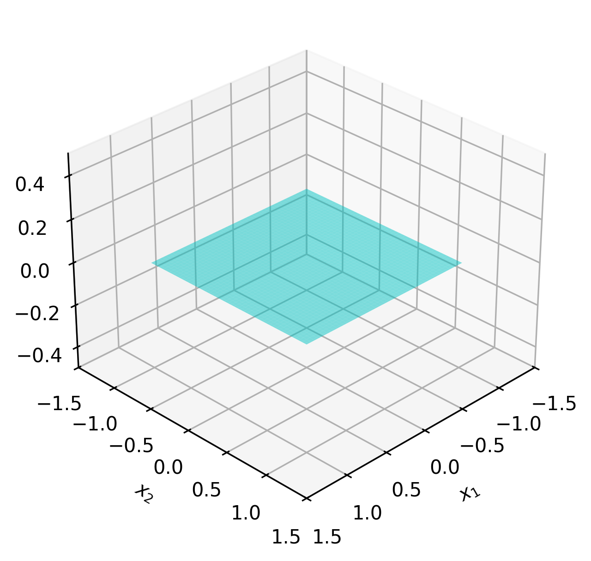
</div>

Sea
$$
C=[-1,1]\times[-1,1]\times\{0\}\subset\RR^3.
$$

La envolvente afín de $C$ es un plano:
$$
\text{aff}\,C=\{\xx\in\RR^3 \mid x_3=0\}.
$$

Como consecuencia, a pesar de que el interior de $C$ es vacío ($\text{int}\,C=\emptyset$), el interior relativo es
$$
\text{relint}\,C=(-1,1)\times(-1,1)\times\{0\}.
$$

:::

<div style="margin-top:2em;"></div>


::: {.definicion}
**Definición 3.** (Conjunto convexo) Un conjunto $C \subset \RR^p$ es *convexo* si el segmento de recta entre cualquier par de puntos distintos en $C$ está contenido en $C$. Es decir, si se verifica
$$
\theta \xx_1+(1-\theta)\xx_2\in C\qquad\forall \xx_1,\xx_2\in C,\; \forall\theta\in[0,1].
$$
:::

<details>
<summary>Mostrar detalles</summary>

::: {.panel-tabset}

### <span style="font-size: 1.25em;">&#x2460;</span>

Llamamos *combinación convexa* a un punto de la forma 
$$
\theta_{1} \xx_{1} + \cdots + \theta_{k} \xx_{k},\qquad \sum_{i=1}^k\theta_i = 1,\; \theta_{i} \geq 0.
$$

Como en el caso de los conjuntos afines, se puede demostrar que un conjunto es convexo si y solo si contiene todas las combinaciones convexas de sus puntos (📝 Ejercicio 1). 

Por otro lado, observar que, a diferencia de una combinación afín, una combinación convexa requiere la no negatividad de los coeficientes $\theta_i$, lo cual significa que puede ser interpretada como un <mark>promedio ponderado</mark> de los puntos $\xx_i$. 

### <span style="font-size: 1.25em;">📝</span>

::: {.callout .question}
<span style="font-size: 1.3em;">📝</span><br>
<div style="margin-top:-0.1em;"></div>

- ¿Cuáles son subconjuntos convexos de $\RR$?
- **Todo conjunto afín es convexo.** ¿Porqué?

:::

:::
</details>


<figure style="text-align: center;">
  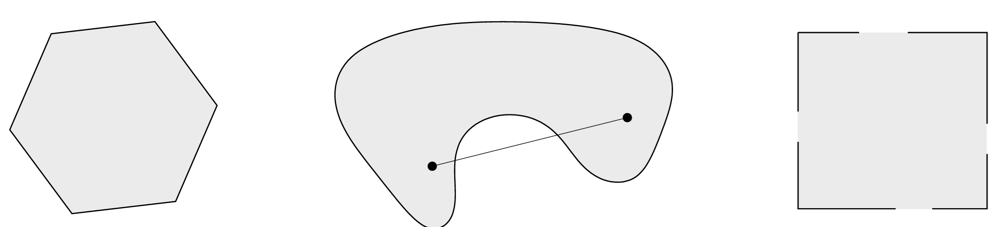
  <figcaption>Conjuntos en $\RR^2$. Únicamente el hexágono, que incluye su frontera, es convexo. ¿Por qué la tercera figura no lo es?</figcaption>
</figure>

<div style="margin-top:2em;"></div>


::: {.callout-example}
<span class="badge bg-primary">Ejemplo 3</span> 
<span style="color: #0d6efd; font-family: Arial; font-weight: bold; font-size: 0.85em;">
  Combinación convexa
</span>

Una empresa diseñó internamente tres posibles estrategias para la oferta de un nuevo producto. Para cada estrategia, realizó un análisis que le permitió estimar el nivel de satisfacción promedio del usuario (de 0 a 10) y el costo de implementación mensual (en miles de dólares), obteniendo:

- Estrategia A (satisfacción y costo altos): $(8.5,25)$.
- Estrategia B (satisfacción y costo medios): $(6.75,17.5)$.
- Estrategia C (satisfacción y costo bajos): $(4,12)$.

En lugar de implementar una única estrategia, la empresa decidió realizar una inversión de manera porcentual, destinando el 60% del presupuesto a la estrategia A, el 25% a la B y el 15% restante a la C. El costo y la satisfacción esperada están determinados por la siguiente combinación convexa:
$$
\frac{3}{5}\cdot (8.5,25)+\frac{1}{4}\cdot (6.75,17.5)+\frac{3}{20}\cdot (4,12)=(7.3875,21.175).
$$

En la siguiente figura podemos ver el resultado obtenido. El triángulo determinado por los puntos dados contiene todas las combinaciones convexas posibles.

<figure style="text-align: center;">
  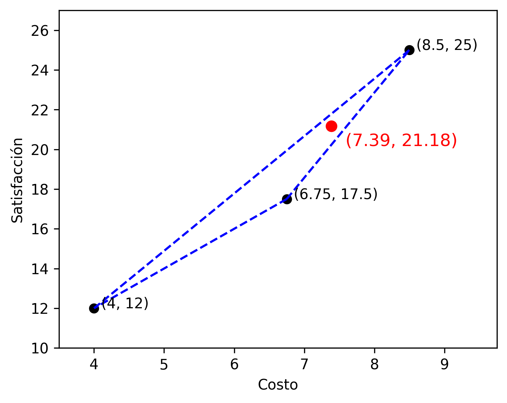
</figure>

:::

<span style="display:block; height:0.25em;"></span>


::: {.definicion}
**Definición 4.** (Envolvente convexa) La *envolvente convexa* de un conjunto $C\subset\RR^p$ es el conjunto de todas las combinaciones convexas de puntos en $C$. Esto es
$$
\text{conv}\,C := \left\{\theta_{1} x_{1} + \cdots + \theta_{k} x_{k}\;\Big|\; x_{i} \in C,\; \theta_{i} \geq 0,\;\sum_{i=1}^k\theta_{i} = 1\right\}.
$$
:::


<details>
<summary>Mostrar detalles</summary>

::: {.panel-tabset}

### <span style="font-size: 1.25em;">&#x2460;</span>

Como su nombre lo indica, la envolvente convexa $\text{conv}\,C$ es siempre un conjunto convexo (📝 Ejercicio 3). 

### <span style="font-size: 1.25em;">&#x2461;</span>

La envolvente convexa $\text{conv}\,C$ es el conjunto convexo más pequeño que contiene a $C$: si $B$ es cualquier conjunto convexo que contiene a $C$, entonces $\text{conv}\,C \subset B$. 

:::
</details>


<figure style="text-align: center;">
  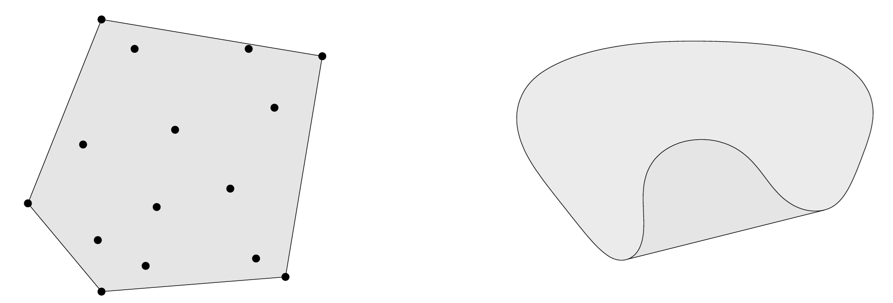
  <figcaption>Envolvente convexa de dos conjuntos: (Izq.) La envolvente convexa de un numero finito de puntos. (Der.) La envolvente convexa de un conjunto infinito no convexo.</figcaption>
</figure>
<span style="display:block; height:0.25em;"></span>


::: {.callout-example}
<span class="badge bg-primary">Ejemplo 4</span> 
<span style="color: #0d6efd; font-family: Arial; font-weight: bold; font-size: 0.85em;">
  Envolvente convexa con `ConvexHull`
</span>

En Python, una herramienta para calcular envolventes convexas es [`scipy.spatial.ConvexHull`](https://docs.scipy.org/doc/scipy/reference/generated/scipy.spatial.ConvexHull.html). Vamos a implementarlo para un conjunto de puntos de $\RR^2$.

```{pyodide-python}
import numpy as np
import matplotlib.pyplot as plt
from scipy.spatial import ConvexHull

# Puntos:
n = 10
np.random.seed(42) 
points = np.random.uniform(0, 10, (n, 2))

# Envolvente convexa:
hull = ConvexHull(points)


# 📈:
plt.figure(figsize=(4,3))

# Gráfica de puntos:
plt.scatter(points[:, 0], points[:, 1], color='black')

# Gráfica de envolvente convexa:
for simplex in hull.simplices:
    plt.plot(points[simplex, 0], points[simplex, 1], 'b-')

plt.grid(True)
plt.tight_layout()
plt.show()


# 📋:
print("Índices de los vértices:", hull.vertices)
print("Coordenadas de los vértices:")
for i in hull.vertices:
  print(points[i])  
```

:::

<div style="margin-top:2em;"></div>


::: {.definicion}
**Definición 5.** (Cono) Un conjunto $C\subset\RR^p$ se denomina *cono* si verifica
$$
\theta\xx\in C\qquad\forall \xx\in C,\; \forall \theta\geq 0.
$$
:::


<details>
<summary>Mostrar detalles</summary>

::: {.panel-tabset}

### <span style="font-size: 1.25em;">&#x2460;</span>

Llamamos *combinación cónica* a un punto de la forma
$$
\theta_1\xx_1+\cdot+\theta_k\xx_j,\qquad \theta_i\geq 0.
$$

### <span style="font-size: 1.25em;">📝</span>

::: {.callout .question}
<span style="font-size: 1.3em;">📝</span><br> 
Muestre que $C$ es un cono convexo si y solo si

$$
\theta_1\xx_1+\theta_2\xx_2\in C\qquad\forall \xx_1,\xx_2\in C,\;\forall \theta_1, \theta_2\geq 0.
$$

:::

Luego, esta caracterización le permitirá probar fácilmente que un conjunto $C$ es un cono convexo si y solo si contiene todas las combinaciones cónicas de sus puntos (📝 Ejercicio 1).

:::
</details>


<figure style="text-align: center;">
  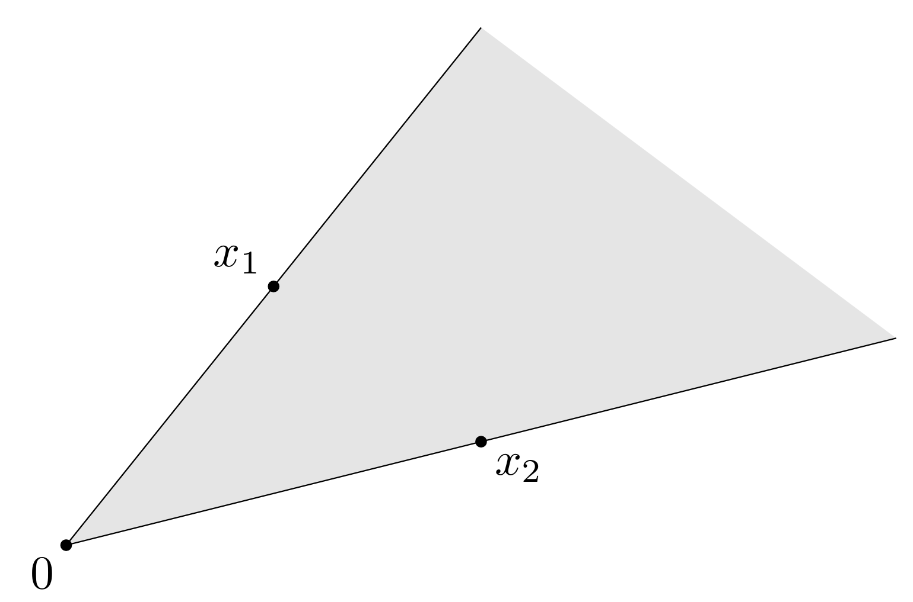
  <figcaption>Conjunto de puntos de la forma $\theta_1\xx_1+\theta_2\xx_2$ para $\xx_1,\xx_2\in\RR^2$.</figcaption>
</figure>

<div style="margin-top:2em;"></div>


::: {.callout-example}
<span class="badge bg-primary">Ejemplo 5</span> 
<span style="color: #0d6efd; font-family: Arial; font-weight: bold; font-size: 0.85em;">
  Cono no convexo y su envolvente convexa
</span>

<div style="float: right; width: 30%; margin-left: 1em; margin-bottom: 1em;">
  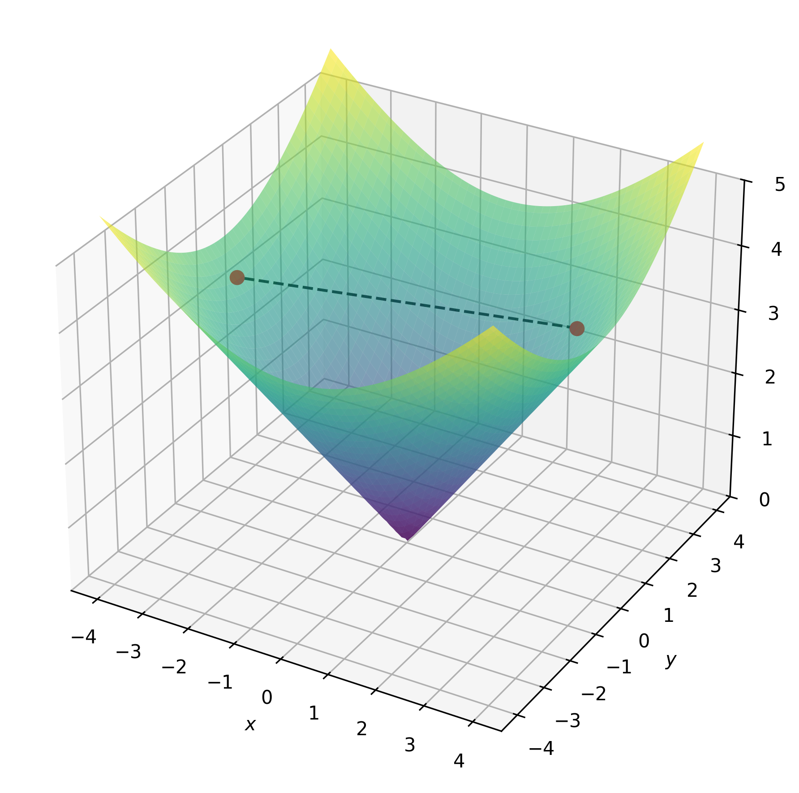
</div>

En $\RR^3$, el conjunto
$$
C=\{(x,y,z)\in\RR^3 \mid z=\sqrt{x^2+y^2}\}
$$
es un cono, pero no es convexo. En la figura se muestran un par de puntos pertenecientes a $C$, pero el segmento entre ellos no. La condición de la Definición 5 de cono es inmediata:
$$
z=\sqrt{x^2+y^2}\Rightarrow\theta z=\sqrt{(\theta x)^2+(\theta y)^2}\qquad\forall\theta\geq 0.
$$

Ahora bien, si consideramos los segmentos entre pares de puntos, obtenemos su envolvente convexa:
$$
\tilde C=\{(x,y,z)\in\RR^3 \mid z\geq\sqrt{x^2+y^2}\}
$$

El conjunto $\tilde{C}$ es un cono convexo. Veamos en el siguiente gráfico que, para dos puntos en $\tilde{C}$ dados, cualquier combinación lineal de la forma $\theta_1\xx_1+\theta_2\xx_2$, con $\theta_1,\theta_2\geq 0$, queda contenida en $\tilde{C}$.

```{pyodide-python}
#| echo: false
#| fig-align: "center"
#| fig-width: 4   # en pulgadas
#| fig-height: 3  # en pulgadas
#| context: ojs
#| input: [theta1, theta2]

import numpy as np
import matplotlib.pyplot as plt
from mpl_toolkits.mplot3d import Axes3D

# Crear malla de puntos para la superficie
x = np.linspace(-10, 10, 25)
y = np.linspace(-10, 10, 25)
X, Y = np.meshgrid(x, y)
Z = np.sqrt(X**2 + Y**2)

# Crear figura 3D
fig = plt.figure(figsize=(4.5,3.5))
ax = fig.add_subplot(111, projection='3d')

# Graficar la superficie del cono
ax.plot_surface(X, Y, Z, alpha=0.6, cmap='viridis')

# Puntos dados
p1 = np.array([2.5, 2, np.sqrt(41/4)])
p2 = np.array([-2.25, -2.25, np.sqrt(81/4)])

# Punto combinación lineal
p_comb = theta1 * p1 + theta2 * p2

# Graficar puntos originales
ax.scatter(*p1, color='red', s=50, label='p1')
ax.scatter(*p2, color='red', s=50, label='p2')

# Graficar punto combinación lineal
ax.scatter(*p_comb, color='blue', s=60, label=r'$\theta_1 p_1 + \theta_2 p_2$')

# Graficar vector posición del punto combinación lineal (desde el origen)
ax.quiver(0, 0, 0, p_comb[0], p_comb[1], p_comb[2], color='blue', linewidth=1.5, arrow_length_ratio=0.1, linestyle='dashed')

# Graficar vector posición de p1 y p2 para referencia
ax.quiver(0, 0, 0, p1[0], p1[1], p1[2], color='red', linestyle='dashed', arrow_length_ratio=0.1)
ax.quiver(0, 0, 0, p2[0], p2[1], p2[2], color='red', linestyle='dashed', arrow_length_ratio=0.1)

# Etiquetas y límites
ax.set_xlabel('$x$')
ax.set_ylabel('$y$')
ax.set_zlabel('$z$')
ax.set_xticks([-10, -5, 0, 5, 10])
ax.set_yticks([-10, -5, 0, 5, 10])
ax.set_zticks([0, 4, 8, 12, 16])
ax.set_xlim(-10, 10)
ax.set_ylim(-10, 10)
ax.set_zlim(0, 16)

#ax.legend()
plt.tight_layout()
plt.show()

```

```{ojs}
//| echo: false
viewof theta1 = Inputs.range([0, 2], {step: 0.01, value: 0.5, label: "θ₁:"})
viewof theta2 = Inputs.range([0, 2], {step: 0.01, value: 0.5, label: "θ₂:"})
```

:::

<div style="margin-top:-0.5em;"></div>
::: {.callout .question}
<span style="font-size: 1.3em;">📝</span><br>
¿La envolvente convexa de un cono es un cono convexo?

:::

<div style="margin-top:2em;"></div>


::: {.definicion}
**Definición 6.** (Envolvente cónica) La *envolvente cónica* de un conjunto $C\in\RR^p$ es el conjunto de todas las combinaciones cónicas de puntos en $C$. Esto es
$$
\text{cone}\,C = \left\{\theta_{1} \xx_{1} + \cdots + \theta_{k} \xx_{k}\mid x_{i} \in C,\; \theta_{i} \geq 0\right\}.
$$
:::


<details>
<summary>Mostrar detalles</summary>

::: {.panel-tabset}

### <span style="font-size: 1.25em;">&#x2460;</span>

La envolvente cónica $\text{cone}\,C$ es siempre un conjunto convexo (📝 Ejercicio 3). 

### <span style="font-size: 1.25em;">&#x2461;</span>

La envolvente cónica $\text{cone}\,C$ es el cono convexo más pequeño que contiene a $C$
 conjunto convexo más pequeño que contiene a $C$: si $B$ es cualquier conjunto convexo que contiene a $C$, entonces $\text{conv}\,C \subset B$. 

:::
</details>


<figure style="text-align: center;">
  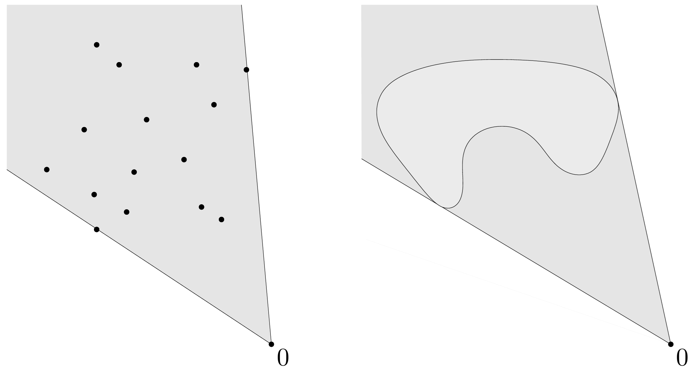
  <figcaption>Envolvente cónica de dos conjuntos: (Izq.) La envolvente convexa de un numero finito de puntos. (Der.) La envolvente convexa de un conjunto infinito no convexo.</figcaption>
</figure>


### Operaciones que preservan convexidad

En esta sección describimos algunas operaciones que preservan la convexidad de conjuntos o nos permiten construir conjuntos convexos a partir de otros. Estas operaciones, junto con los ejemplos simples descritos anteriormente, forman un cálculo de conjuntos convexos que es útil para determinar o establecer la convexidad de conjuntos. Las verificaciones se dejan como ejercicio.

- **Intersección**. 

:::{.myhighlight}
La intersección de cualquier número de conjuntos convexos es convexo.
:::

<div style="margin-top:2em;"></div>

- **Funciones afines**. Si $S\subset \RR^{p}$ es convexo y $f: \mathbf{R}^{p} \to \mathbf{R}^{m}$ es una función afín, entonces, la imagen de $S$ bajo $f$, $f(S) := \{f(\xx) \mid \xx \in S\}$, es convexa. De manera similar, si $f: \RR^{k} \to \RR^{p}$ es una función afín, la imagen inversa de $S$ bajo $f$, $f^{-1}(S) := \{\xx \mid f(\xx) \in S\}$, es convexa.


<aside>$f:\RR^p\to\RR^m$ es *afín* si es de la forma $f(\xx)=A\xx+\bb$, con $A\in\RR^{m\times p}$ y $\bb\in\RR^m$.</aside>


- **Suma**. Si $S_1$ y $S_2$ son conjuntos convexos de $\RR^p$, entonces 
$$
S_{1} + S_{2} := \{\xx_1 + \xx_2 \mid \xx_1 \in S_{1}, \xx_2 \in S_{2}\}
$$
es un conjunto convexo. 


### Conjuntos convexos notables

Vamos a describir algunos conjuntos convexos importantes. Pero primero veamos algunos ejemplos sencillos y analicemos si, además de ser convexos, son conjuntos afines y/o conos. 


::: {.callout .question}
<span style="font-size: 1.3em;">📝</span><br>
<style>
  table {
    border-collapse: collapse;
    width: 100%;
    text-align: center;
  }

  th, td {
    padding: 8px;
  }

  th {
    color: black;
  }

  tr {
    border-bottom: 1px solid lightgray;
  }

  td:first-child, th:first-child {
    white-space: nowrap;
    text-align: center;
  }
</style>

<table>
  <thead>
    <tr>
      <th>Conjunto</th>
      <th>¿Es afín?</th>
      <th>¿Es cono?</th>
    </tr>
  </thead>
  <tbody>
    <tr>
      <td>$\emptyset$</td>
      <td><input type="checkbox" name="afin1" /></td>
      <td><input type="checkbox" name="cono1" /></td>
    </tr>
    <tr>
      <td>$\RR^p$</td>
      <td><input type="checkbox" name="afin2" /></td>
      <td><input type="checkbox" name="cono2" /></td>
    </tr>
    <tr>
      <td>$\{\bfzero\}$</td>
      <td><input type="checkbox" name="afin3" /></td>
      <td><input type="checkbox" name="cono3" /></td>
    </tr>
    <tr>
      <td>Conjunto unitario $\{\xx_0\}$ con $\xx_0\neq\mathbf{0}$</td>
      <td><input type="checkbox" name="afin4" /></td>
      <td><input type="checkbox" name="cono4" /></td>
    </tr>
    <tr>
      <td>Segmento de recta</td>
      <td><input type="checkbox" name="afin5" /></td>
      <td><input type="checkbox" name="cono5" /></td>
    </tr>
    <tr>
      <td>Recta</td>
      <td><input type="checkbox" name="afin6" /></td>
      <td><input type="checkbox" name="cono6" /></td>
    </tr>
    <tr>
      <td>Recta que pasa por el origen</td>
      <td><input type="checkbox" name="afin7" /></td>
      <td><input type="checkbox" name="cono7" /></td>
    </tr>
    <tr>
      <td>Rayo $\{\theta\vv\mid\vv\neq\bfzero,\;\theta\geq 0\}$</td>
      <td><input type="checkbox" name="afin9" /></td>
      <td><input type="checkbox" name="cono9" /></td>
    </tr>
    <tr>
      <td>Rayo $\{\xx_0+\theta\vv\mid\xx_0,\vv\neq\bfzero,\;\theta\geq 0\}$</td>
      <td><input type="checkbox" name="afin10" /></td>
      <td><input type="checkbox" name="cono10" /></td>
    </tr>
    <tr>
      <td>Subespacio</td>
      <td><input type="checkbox" name="afin11" /></td>
      <td><input type="checkbox" name="cono11" /></td>
    </tr>
  </tbody>
</table>

:::


#### Hiperplanos y semiespacios

Un <mark>*hiperplano*</mark> en $\RR^p$ es un conjunto de la forma
$$
\{\xx \mid \aa^\top \xx=b\},\qquad \aa\in\RR^p,\;\aa\neq\bfzero,\;b\in\RR.
$$

<details>
<summary>Mostrar detalles</summary>

::: {.panel-tabset}

### <span style="font-size: 1.25em;">&#x2460;</span>

El vector $\aa$ es *normal* al hiperplano. Dado un punto $\xx_0$ del hiperplano, se verifica $\aa^\top (\xx-\xx_0)=0$ para todo punto $\xx$ del hiperplano.

### <span style="font-size: 1.25em;">&#x2461;</span>

El escalar $b$ determina el desplazamiento del hiperplano respecto del origen. En efecto, la distancia del hiperplano al origen es $b/\|\aa\|$ (probaremos esto más adelante en este capítulo).

### <span style="font-size: 1.25em;">📝</span>

::: {.callout .question}
<span style="font-size: 1.3em;">📝</span><br>
<div style="margin-top:-0.1em;"></div>

- ¿Qué es un hiperplano en $\RR^2$ y $\RR^3$? Proponga ejemplos.
- **Un hiperplano es un conjunto afín.** ¿Porqué?

:::

:::
</details>


<figure style="text-align: center;">
  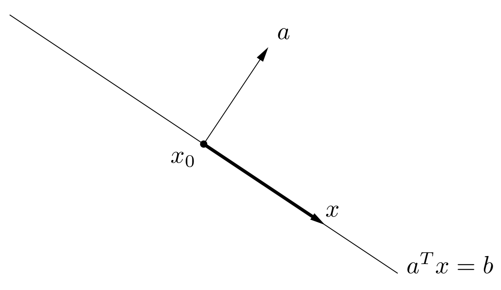
  <figcaption>Hiperplano en $\RR^2$ con vector normal $\aa$.</figcaption>
</figure>

<div style="margin-top:2em;"></div>


Un hiperplano divide a $\RR^p$ en dos <mark>*semiespacios*</mark>. Un semiespacio cerrado es un conjunto de la forma
$$
\{\xx \mid \aa^\top \xx\leq b\},\qquad \aa\in\RR^p,\;\aa\neq\bfzero,\;b\in\RR.
$$

<figure style="text-align: center;">
  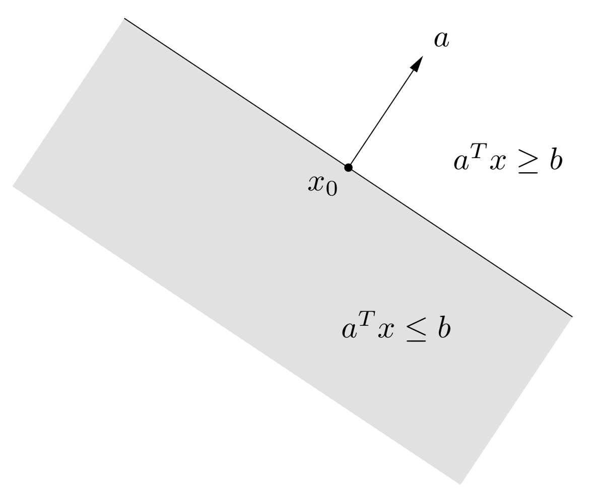
  <figcaption>Los dos semiespacios definidos por un hiperplano en $\RR^2$.</figcaption>
</figure>


<div style="margin-top:-0.5em;"></div>
::: {.callout .question}
<span style="font-size: 1.3em;">📝</span><br>
¿Qué podemos afirmar sobre los semiespacios?

:::

<div style="margin-top:2em;"></div>


#### Bolas

Un <mark>*bola*</mark> en $\RR^p$, de *centro* $\xx_0$ y *radio* $r$, es un conjunto de la forma
$$
B(\xx_0,r):=\{\xx \mid \|\xx-\xx_0\|_2\leq r\},\qquad \xx_0\in\RR^p,\;r\in\RR^+.
$$


::: {.callout .question}
<span style="font-size: 1.3em;">📝</span><br>
¿Qué es una bola en $\RR^2$ y $\RR^3$? Proponga ejemplos.

:::


<div style="margin-top:-0.5em;"></div>
::: {.callout .question}
<span style="font-size: 1.3em;">📝</span><br>
Muestre que una bola en $\RR^p$ es un conjunto convexo.

:::

<div style="margin-top:2em;"></div>


#### Poliedros

Un <mark>*poliedro*</mark> en $\RR^p$ es el conjunto solución de un número finito de igualdades y desigualdades lineales. Es decir, es de la forma
$$
\mathcal{P}:=\{\xx \mid A\xx\preceq\bb,\; C\xx=\dd\},\qquad A\in\RR^{r\times p},\;C\in\RR^{m\times p},\; \bb\in\RR^r,\;\dd\in\RR^m.
$$


Las igualdades y desigualdades son:
$$
\aa_i^\top\xx\leq b_i,\qquad i=1,\ldots,r,
$$
$$
\cc_j^\top\xx= d_j,\qquad j=1,\ldots,m.
$$

Esto deriva en la razón por la cual un poliedro es un conjunto convexo:

:::{.myhighlight}
Un poliedro es la intersección de un número finito de semiespacios e hiperplanos.
:::

<div style="margin-top:2em;"></div>

<figure style="text-align: center;">
  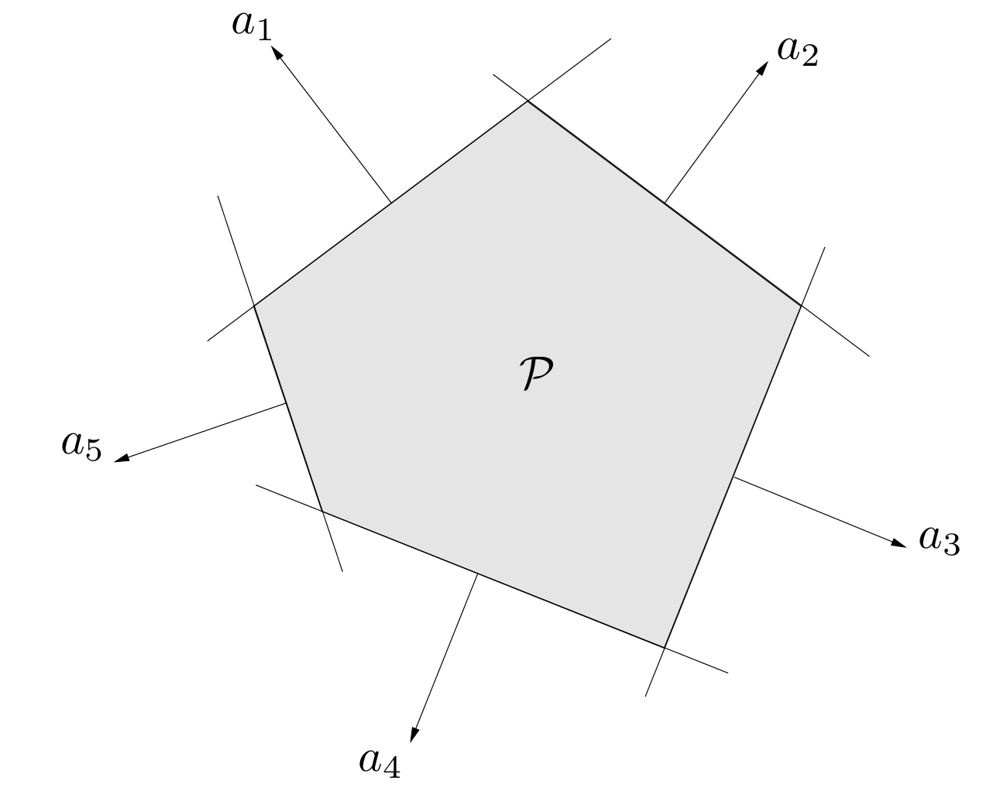
  <figcaption>Un poliedro generado por la intersección de 5 semiespacios.</figcaption>
</figure>


::: {.callout .question}
<span style="font-size: 1.3em;">📝</span><br>
La definición de poliedro es lo suficientemente general como para incluir muchos tipos de conjuntos convexos que ya hemos visto. ¿Cuáles?

:::

<div style="margin-top:2em;"></div>


::: {.callout-example}
<span class="badge bg-primary">Ejemplo 6</span> 
<span style="color: #0d6efd; font-family: Arial; font-weight: bold; font-size: 0.85em;">
  Símplex
</span>

El *$p$-símplex estándar* en $\RR^{n}$ es el conjunto
$$
\Delta^{p-1}=\left\{\xx\in\RR^p \left|\;\sum_{i=1}^p x_i=1,\; t_i\geq 0\, (\forall i=1,\ldots,p)\right.\right\}.
$$

Es un poliedro, ya que puede expresarse como la intersección de:

- El hiperplano definido por $\sum_{i=1}^p x_i=1$.
- Los $n+1$ semiespacios definidos por $x_i\geq 0$, con $i=1,\ldots,p$.

<figure style="text-align: center;">
  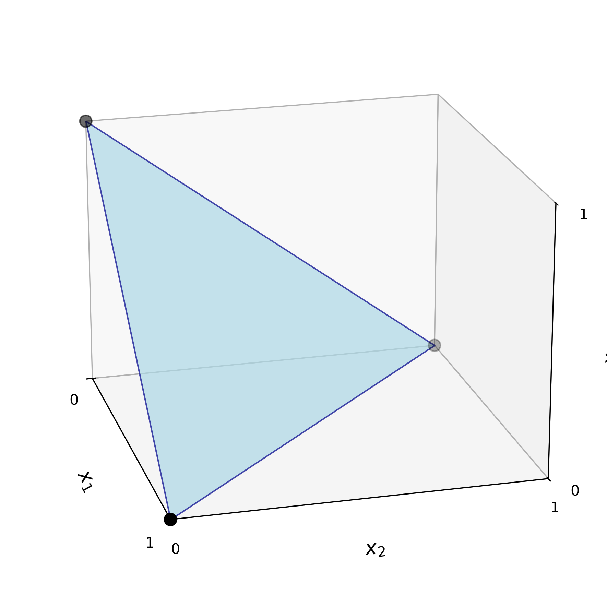
  <figcaption>$\Delta^2$ es un triángulo en $\RR^3$ de vértices $(1,0,0)$, $(0,1,0)$ y $(0,0,1)$.</figcaption>
</figure>

:::


### Conos normales

En muchos problemas de optimización, especialmente aquellos en los que las soluciones están restringidas a un conjunto convexo, es esencial entender cómo se comportan las direcciones "externas" al conjunto en torno a un punto dado.

El cono normal es una herramienta geométrica fundamental para describir esas direcciones. Nos permitirá luego expresar condiciones que caracterizan soluciones óptimas a partir de información local del conjunto factible.

::: {.definicion}
**Definición 7.** (Cono normal) Sean $\Omega\subset\RR^p$ un conjunto convexo y $\xx_0\in\Omega$. El *cono normal de $\Omega$ en $\xx$* se define como
$$
N_{\Omega}(\xx_0) := \{\dd\in\RR^p \mid \langle\dd,\xx-\xx_0\rangle\leq 0,\;\forall\xx\in\Omega\}.
$$
:::


Si bien la expresión $\langle \dd,\xx-\xx_0\rangle$ puede escribirse como $\dd^\top(\xx-\xx_0)$, la notación con producto interno permite una rápida interpretación de este concepto. Si usamos la propiedad $\langle\uu,\vv\rangle =\|\uu\|_2\|\vv\|_2\cos \alpha$, donde $\alpha$ es el ángulo entre $\uu$ y $\vv$, podemos decir que $\dd\in N_{\Omega}(\xx_0)$ si
$$
\|\dd\|\|\xx-\xx_0\|\cos \alpha \leq 0,
$$
con $\alpha$ el ángulo entre los vectores $\dd$ y $\xx-\xx_0$. Esto es cierto si 
$$
-\frac{\pi}{2}\leq \alpha\leq\pi.
$$

Por lo tanto:

:::{.myhighlight}
El cono normal consta de aquellas direcciones que forman un ángulo obtuso o recto con todas las direcciones $\xx-\xx_0$, junto con la dirección nula $\dd=\bfzero$.
:::

<div style="margin-top:2em;"></div>


<figure style="text-align: center;">
  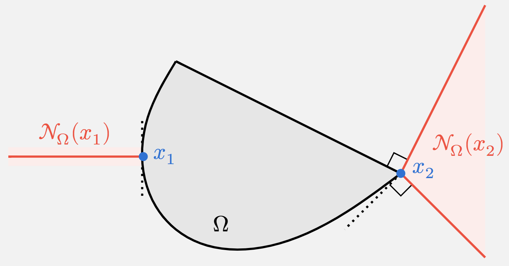
  <figcaption>Conos normales de un conjunto convexo. A diferencia de lo que ocurre en $\xx_2$ (vértice de $\Omega$), en $\xx_1$ el cono normal es una semirrecta normal a $\Omega$.</figcaption>
</figure>

<span style="display:block; height:0.25em;"></span>


Para entender mejor esta definición, vamos a ver algunos ejemplos.

<div style="margin-top:2em;"></div>


::: {.callout-example}

<span class="badge bg-primary">Ejemplo 7</span>
<span style="color: #0d6efd; font-family: Arial; font-weight: bold; font-size: 0.85em;">
  Cono normal a un punto interior
</span>

Si $\xx_0$ es un punto interior de $\Omega$, el cono normal contiene únicamente el vector cero:  
$$
N_{\Omega}(\xx_0) = \{\mathbf{0}\}.
$$

:::{.columns}
::: {.column width="70%"}

Esto se debe a que $\xx-\xx_0$ puede ser *cualquier* dirección y, en consecuencia, no es posible que $\dd\neq\bfzero$ forme un ángulo obtuso o recto con todas las direcciones $\xx-\xx_0$. En efecto, si $\dd\neq\mathbf{0}$, podemos tomar un $\delta>0$ lo suficientemente pequeño para que $\xx=\xx_0+\delta\dd\in\Omega$, tal que
$$
\langle \dd,\xx-\xx_0\rangle=\langle\dd,\delta\dd\rangle=\delta\|\dd\|^2\geq 0.
$$
:::

::: {.column width="30%"}
<figure style="text-align: center;">
  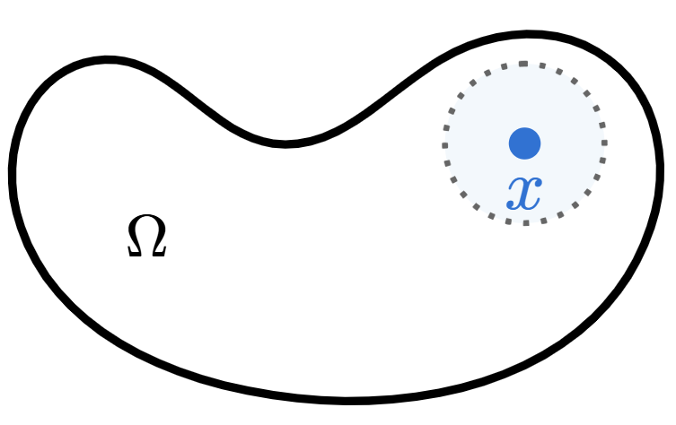
</figure>

:::
:::
:::


::: {.callout-example}

<span class="badge bg-primary">Ejemplo 8</span>
<span style="color: #0d6efd; font-family: Arial; font-weight: bold; font-size: 0.85em;">
  Cono normal a un hiperplano
</span>

Sea $\aa\in\RR^p$, $\aa\neq\mathbf{0}$, y $b\in\RR$. Consideramos el hiperplano
$$
\Omega:=\{\xx\in\RR^p \mid \aa^\top\xx=b\}.
$$

:::{.columns}
::: {.column width="70%"}
El cono normal a un punto $\xx_0\in\Omega$ es la recta con dirección $\aa$. Esto es,
$$
N_{\Omega}(\xx_0)=\{\lambda\aa \mid \lambda\in\RR\}.
$$

La verificación se deja como tarea (📝 Ejercicio 7).
:::

::: {.column width="30%"}
<figure style="text-align: center;">
  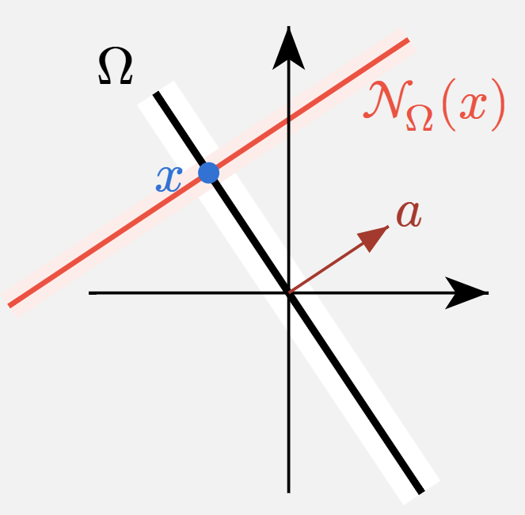
</figure>

:::
:::
:::


::: {.callout-example}

<span class="badge bg-primary">Ejemplo 9</span>
<span style="color: #0d6efd; font-family: Arial; font-weight: bold; font-size: 0.85em;">
  Cono normal a un semiespacio
</span>

Sean $\aa\in\RR^p$, $\aa\neq\mathbf{0}$, y $b\in\RR$. Definimos el semiespacio
$$
\Omega:=\{\xx\in\RR^p \mid \aa^\top\xx\leq b\}.
$$

:::{.columns}
::: {.column width="70%"}
- Si $\xx_0$ está en el interior de $\Omega$, $\aa^\top\xx_0<b$, el cono normal es $N_{\Omega}(\xx_0)=\{\mathbf{0}\}$. 

- Si $\xx_0$ está en la frontera de $\Omega$, $\aa^\top\xx_0=b$, resulta
$$
N_{\Omega}(\xx_0)=\{\lambda\aa \mid \lambda\in\RR_0^+\}.
$$

La diferencia con el ejemplo anterior radica en que ahora el cono normal es una semirrecta.

:::

::: {.column width="30%"}
<figure style="text-align: center;">
  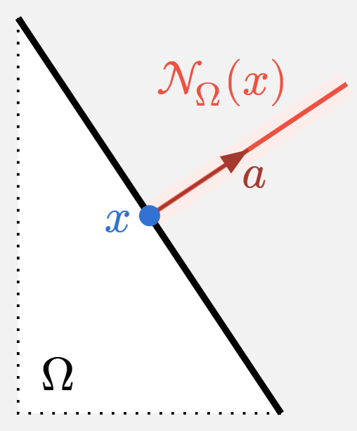
</figure>

:::
:::
:::


::: {.callout-example}

<span class="badge bg-primary">Ejemplo 10</span>
<span style="color: #0d6efd; font-family: Arial; font-weight: bold; font-size: 0.85em;">
  Cono normal a la intersección de dos semiespacios
</span>

Sean $\aa_1,\aa_2\in\RR^p$ no nulos, y $b_1,b_2\in\RR$. Definimos la intersección de dos semiplanos como
$$
\Omega:=\{\xx\in\RR^p \mid \aa_1^\top\xx\leq b_1\quad\text{y}\quad\aa_2^\top\xx\leq b_2\}.
$$

:::{.columns}
::: {.column width="70%"}
- Si $\xx_0$ está en el interior de $\Omega$ o en la frontera de solo uno de los semiespacios, el cono normal resulta del ejemplo anterior.

- Si $\xx_0$ está en la intersección de ambas fronteras, $\aa_1^\top\xx_0=b_1$ y $\aa_2^\top\xx_0=b_2$, entonces el cono normal es la envolvente cónica de las direcciones $\aa_1$ y $\aa_2$. Esto es
$$
N_{\Omega}(\xx_0)=\{\lambda_1\aa_1+\lambda_2\aa_2 \mid \lambda_1,\lambda_2\in\RR_0^+\}.
$$

:::

::: {.column width="30%"}
<figure style="text-align: center;">
  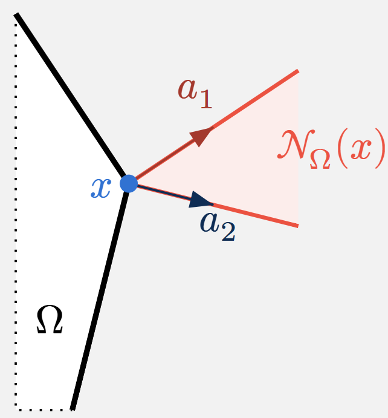
</figure>

:::
:::

Probaremos este resultado, generalizado a $r$ semiespacios, en [C1-S2](A4_condiciones_optimalidad.html#condiciones-de-karush-kuhn-tucker-kkt).

:::


## Funciones convexas

::: {.definicion}
**Definición 8.** (Función convexa) Una función $f:\RR^p\rightarrow\RR$ es *convexa* si $\text{dom}\,f$ es un conjunto convexo y si verifica
$$
f(\theta \xx_1 + (1 - \theta)\xx_2) \leq \theta f(\xx_1) + (1 - \theta)f(\xx_2)\qquad\forall\xx_1,\xx_2\in\text{dom}\,f,\; \forall\theta\in[0,1].
$$

Si la desigualdad es estricta para $\xx_1\neq \xx_2$ y $0<\theta<1$, se dice que $f$ es *estrictamente convexa*. Además, se dice que $f$ es *cóncava* (o *estrictamente cóncava*) si $-f$ es convexa (o estrictamente convexa).
:::


<details>
<summary>Mostrar detalles</summary>

::: {.panel-tabset}

### <span style="font-size: 1.25em;">&#x2460;</span>

La desigualdad de la definición significa que el segmento de recta entre los puntos $(\xx_1, f(\xx_1))$ y $(\xx_2, f(\xx_2))$ se encuentra por encima de la gráfica de $f$. 

<figure style="text-align: center;">
  
  <figcaption>Grafo de una función convexa.</figcaption>
</figure>

### <span style="font-size: 1.25em;">&#x2461;</span>

Una función afín verifica la igualdad en la definición, por lo que todas las funciones afines (y, por lo tanto, también las lineales) son tanto convexas como cóncavas. Recíprocamente, una función que es tanto convexa como cóncava es siempre una función afín.

### <span style="font-size: 1.25em;">&#x2462;</span>

Una función es convexa si y solo si, para todo $\xx\in\text{dom}\,f$ y $\vv\in\RR^p$, la restricción $g(t)=f(\xx+t\vv)$ es convexa en su dominio $\{t \mid \xx+t\vv\in\text{dom}\,f\}$.

:::
</details>

<div style="margin-top:2em;"></div>


::: {.callout-example}

<span class="badge bg-primary">Ejemplo 11</span>
<span style="color: #0d6efd; font-family: Arial; font-weight: bold; font-size: 0.85em;">
  Función cuadrática de una variable
</span>

Vamos a probar la convexidad de la función $f(x)=x^2$. Para $\theta\in[0,1]$ resulta
$$
\begin{align*}
f(\theta x_1+(1-\theta)x_2)&=(\theta x_1+(1-\theta)x_2)^2\\
&=\theta^2x_1^2+2\theta(1-\theta)x_1x_2+(1-\theta)^2x_2^2
\end{align*}
$$

Entonces
$$
\begin{align*}
f(\theta x_1+(1-\theta)x_2)-\left[\theta f(x_1)+(1-\theta) f(x_2)\right]&=(\theta^2-\theta)x_1^2+2\theta(1-\theta)x_1x_2+(\theta^2-\theta)x_2^2\\
&=-\theta(1-\theta)(x_1^2-2x_1x_2+x_2^2)\\
&=-\theta(1-\theta)(x_1-x_2)^2\\
&\leq 0
\end{align*}
$$

lo cual concluye la prueba.

:::

<div style="margin-top:2em;"></div>


El <mark>*epígrafo*</mark> de una función $f:\RR^p\to\RR$ se define como
$$
\text{epi}\,f = \{(\xx, t) \mid \xx \in \text{dom}\,f, f(\xx) \leq t\},
$$

<figure style="text-align: center;">
  
  <figcaption>Epígrafo de una función $f$.</figcaption>
</figure>


La relación entre conjuntos convexos y funciones convexas es a través del epígrafo: 

:::{.myhighlight}
Una función es convexa si y solo si su epígrafo es un conjunto convexo.
:::

<div style="margin-top:2em;"></div>

La prueba es sencilla (📝Ejercicio ...). De manera análoga, una función es cóncava si y solo si su *hipógrafo*, definido como
$$
\text{hypo}\,f = \{(\xx, t) \mid t \leq f(\xx)\},
$$
es un conjunto convexo.


### Condiciones de convexidad

Probar que una función es convexa utilizando la Definición 8 puede ser tedioso. Afortunadamente, existen criterios basados en sus derivadas. Estos permiten caracterizar la convexidad en términos del comportamiento local de la función, ya sea a través del gradiente (primera derivada) o de la matriz Hessiana (segunda derivada). 

Primero, recordemos que:

- El gradiente $\nabla f:\RR^p\to\RR^p$ se define como
$$
\nabla f(\xx):=\left(\frac{\partial f}{\partial x_1}(\xx),\ldots,\frac{\partial f}{\partial x_p}(\xx_0\right).
$$

- La matriz Hessiana $\nabla^2 f:\RR^p\to\RR^{p\times p}$ se define como
$$
\nabla^2 f(\xx):=\begin{pmatrix}
\displaystyle \frac{\partial^2 f}{\partial x_1^2}(\xx) & \displaystyle \frac{\partial^2 f}{\partial x_1 \partial x_2}(\xx) & \ldots & \displaystyle \frac{\partial^2 f}{\partial x_1 \partial x_p}(\xx) \\
\displaystyle \frac{\partial^2 f}{\partial x_2 \partial x_1}(\xx) & \displaystyle \frac{\partial^2 f}{\partial x_2^2}(\xx) & \ldots & \displaystyle \frac{\partial^2 f}{\partial x_2 \partial x_p}(\xx) \\
\vdots & \vdots & \ddots & \vdots \\
\displaystyle \frac{\partial^2 f}{\partial x_p \partial x_1}(\xx) & \displaystyle \frac{\partial^2 f}{\partial x_p \partial x_2}(\xx) & \ldots & \displaystyle \frac{\partial^2 f}{\partial x_p^2}(\xx)
\end{pmatrix}
$$


<div class="alert alert-light text-dark" role="important">
<span class="badge bg-warning text-dark">Importante</span>

Diremos que $f:\RR^p\to\RR$ es *diferenciable* si su gradiente $\nabla f$ existe en todo su dominio, y que es *dos veces diferenciable* si además su hessiana $\nabla^2 f$ existe en todo su dominio. En ambos casos, asumimos que dicho dominio es un conjunto abierto.

</div>


<span style="color:darkred;">Acá recordar Taylor...</span>

<div style="margin-top:2em;"></div>


::: {.teorema}
**Teorema 1.** (Condición de primer orden para convexidad) 
Sea $f:\RR^p\to\RR$ una función diferenciable. $f$ es convexa si y solo si $\text{dom}\,f$ es convexo y 
$$
f(\xx_2)\geq f(\xx_1)+\langle\nabla f(\xx_1),\xx_2-\xx_1\rangle\qquad\forall\xx_1,\xx_2\in\text{dom}\,f.
$$
:::


<details>
<summary>Mostrar detalles</summary>

::: {.panel-tabset}

### <span style="font-size: 1.25em;">&#x2460;</span>

La función afín de $\xx_2$, definida por $f(\xx_1) + \langle \nabla f(\xx_1), \xx_2 - \xx_1 \rangle$, es la aproximación lineal de $f$ cerca de $\xx_1$. En consecuencia, la desigualdad del teorema implica que la aproximación lineal de $f$ en $\xx_1$ es un *subestimador global* de $f$.

<figure style="text-align: center;">
  
  <figcaption>Grafo de una función convexa $f$ y su aproximación lineal.</figcaption>
</figure>

### <span style="font-size: 1.25em;">&#x2461;</span>

La convexidad estricta también puede caracterizarse por una condición de primer orden: $f$ es estrictamente convexa si y solo si $\text{dom}\,f$ es convexo y
$$
f(\xx_2) > f(\xx_1) + \langle \nabla f(\xx_1), \xx_2 - \xx_1 \rangle
$$
para todo $\xx_1, \xx_2 \in \text{dom}\,f$, con $\xx_1 \neq \xx_2$.

### <span style="font-size: 1.25em;">&#x2462;</span>

Para funciones cóncavas, tenemos la caracterización correspondiente: $f$ es cóncava si y solo si $\text{dom}\,f$ es convexo y
$$
f(\xx_2) \leq f(\xx_1) + \langle \nabla f(\xx_1), \xx_2 - \xx_1 \rangle
$$
para todo $\xx_1, \xx_2 \in \text{dom}\,f$.


### <span style="border: 1px solid #ddd; padding: 2px 6px; border-radius: 4px;">*Demostración*</span>

Supongamos que $f$ es convexa y sean $\xx_1,\xx_2\in\text{dom}\,f$. Entonces, por definición, $\text{dom}\,f$ es convexo; en consecuencia $\xx_1+t(\xx_2-\xx_1)\in\text{dom}\,f$ para todo $0<t\leq 1$. La convexidad de $f$ nos permite escribir

$$
f(\xx_1+t(\xx_2-\xx_1))=f((1-t)\xx_1+t\xx_2)\leq (1-t)f(\xx_1)+tf(\xx_2).
$$

Diviendo ambos lados de la desigualdad por $t$, resulta

$$
f(\xx_2)\geq f(\xx_1)+\frac{f(\xx_1+t(\xx_2-\xx_1))-f(\xx_1)}{t}.
$$

Al tomar límite cuando $t\to 0$, el cociente incremental del lado derecho es la derivada direccional de $f$ en $\xx_1$ en la dirección del vector $\xx_2-\xx_1$, lo cual es equivalente a $\langle \nabla f(\xx_1),\xx_2-\xx_1\rangle$ en virtud de la diferenciabilidad de $f$. Luego,

$$
f(\xx_2)\geq f(\xx_1)+\langle\nabla f(\xx_1),\xx_2-\xx_1\rangle.
$$

Para probar la suficiencia, vamos a asumir que sí se cumple para funciones de una variable (se deja como ejercicio). Sean $\xx_1,\xx_2\in\text{dom}\,f$ y $t,\tilde{t}\in(0,1]$. Partimos de la desigualdad

$$
f(t\xx_2+(1-t)\xx_1)\geq f(\tilde{t}\xx_2+(1-\tilde{t})\xx_1)+\langle \nabla f(\tilde{t}\xx_2+(1-\tilde{t})\xx_1),(\xx_2-\xx_1)\rangle (t-\tilde{t}).
$$

Si restringimos $f$ a la recta entre $\xx_1$ y $\xx_2$, tenemos la función de una variable $g(t)=f(t\xx_2+(1-t)\xx_1)$. Por regla de la cadena, tenemos $g'(t)\langle \nabla f(t\xx_2+(1-t)\xx_1),\xx_2-\xx_1\rangle$. En consecuencia, la desigualdad anterior puede reescribirse como

$$
g(t)\geq g(\tilde{t})+g'(\tilde{t})(t-\tilde{t}).
$$

Luego, $g$ es convexa y, dado que la restricción sobre una recta es arbitraria (ver observaciones de la definición de funciones convexas), $f$ es convexa. $\qquad\blacksquare$

:::
</details>


Una consecuencia importante del Teorema 1 es la siguiente: si para algún $\xx_0\in\text{dom}\,f$ se verifica $\nabla f(\xx_0) =\bfzero$, entonces $f(\xx) \geq f(\xx_0)$ para todo $\xx \in \text{dom}\,f$. Es decir, podemos afirmar que:

:::{.myhighlight}
Si $f$ es una función convexa, cuyo $\text{dom}\,f$ es un conjunto abierto, y para algún $\xx$ se verifica $\nabla f(\xx)=\bfzero$, entonces $\xx$ es un mínimo global de $f$.
:::

<div style="margin-top:2em;"></div>


::: {.teorema}
**Teorema 2.** (Condición de segundo orden para convexidad) 
Sea $f:\RR^p\to\RR$ una función dos veces diferenciable. $f$ es convexa si y solo si $\text{dom}\,f$ es convexo y 
$$
\nabla^2 f(\xx)\succeq 0\qquad\forall\xx\in\text{dom}\,f.
$$

:::

<aside>
$A\succeq 0$ significa que $A$ es *semidefinida positiva*. Esto es, $\xx^\top A\xx\geq 0$ para todo $\xx\in\RR^p$.
</aside>


<details>
<summary>Mostrar detalles</summary>

::: {.panel-tabset}

### <span style="font-size: 1.25em;">&#x2460;</span>

- Para funciones de una variable, la condición se reduce a $f''(x)\geq 0$, lo cual implica que la derivada $f'(x)$ es no decreciente.

### <span style="font-size: 1.25em;">&#x2461;</span>

La convexidad estricta también puede caracterizarse por una condición de segundo orden, pero de manera parcial: si $\text{dom}\,f$ es convexo y $\nabla^2 f\succ 0$ para todo $\xx\in\text{dom}\,f$, entonces $f$ es estrictamente convexa. El recíproco no es cierto: por ejemplo, $f(x)=x^4$ es estrictamente convexa pero $f''(0)=0$.

### <span style="font-size: 1.25em;">&#x2462;</span>

Para funciones cóncavas, tenemos la caracterización correspondiente: $f$ es cóncava si y solo si $\text{dom}\,f$ es convexo y $\nabla^2 f(\xx)\preceq 0$ para todo $\xx\in\text{dom}\,f$.

### <span style="border: 1px solid #ddd; padding: 2px 6px; border-radius: 4px;">*Demostración*</span>

<span style="color:darkred;">Ver si poner...</span>

:::
</details>


<div style="margin-top:-0.5em;"></div>
::: {.callout .question}
<span style="font-size: 1.3em;">📝</span><br>
Analice la convexidad de las siguientes funciones:

- $f:\RR\to\RR: f(x)=e^{ax}$, con $a\in\RR$.

- $f:\RR^+\to\RR: f(x)=x^a$, con $a\in\RR$.

- $f:\RR^+\to\RR: f(x)=|x|^p$, con $p\geq 1$.

- $f:\RR^+\to\RR: f(x)=\log x$.

- $f:\RR^+\to\RR: f(x)=x\log x$.

:::


::: {.callout-example}

<span class="badge bg-primary">Ejemplo 12</span> 
<span style="color: #0d6efd; font-family: Arial; font-weight: bold; font-size: 0.85em;">
  Función cuadrática de varias variables
</span>


Consideremos la función cuadrática $f:\RR^p\to\RR$ definida por

$$
f(\xx)=\frac{1}{2}\xx^\top A\xx+\bb^\top\xx+c,
$$

donde $A\in\SS^p:=\{X\in\RR^{p\times p} \mid X=X^\top\}$, $\bb\in\RR^p$ y $c\in\RR$. Dado que $\nabla^2 f(\xx)=A$ para todo $\xx$, podemos afirmar que $f$ es convexa si y sólo si $A\succeq 0$. 

Así, por ejemplo, la función $f:\RR^2\to\RR$ definida por

$$
f(x,y)=\frac{1}{2}\begin{pmatrix}x&y\end{pmatrix}\begin{pmatrix}2&1\\1&3\end{pmatrix}\begin{pmatrix}x\\ y\end{pmatrix}=\frac{1}{2}(2x^2+2xy+3y^2)
$$

es convexa, ya que $\xx^\top A\xx=2x^2+2xy+3y^2=x^2+(x+y)^2+2y^2\geq 0$ para todo $(x,y)\in\RR^2$, lo cual significa que $A\succeq 0$.


```{python}
#| code-fold: true
#| code-summary: "Mostrar código"
#| fig-align: "center"


import numpy as np
import matplotlib.pyplot as plt
from mpl_toolkits.mplot3d import Axes3D  # para 3D

# Definir la matriz A (simétrica)
A = np.array([[2, 1],
              [1, 3]])

# Crear una malla de puntos en R^2
x = np.linspace(-3, 3, 100)
y = np.linspace(-3, 3, 100)
X, Y = np.meshgrid(x, y)

# Evaluar la función f(x) = 1/2 x^T A x
Z = 0.5 * (A[0,0]*X**2 + (A[0,1] + A[1,0])*X*Y + A[1,1]*Y**2)


# 📈:
fig = plt.figure(figsize=(8,6))
ax = fig.add_subplot(111, projection='3d')
ax.plot_surface(X, Y, Z, cmap='viridis', alpha=0.8)
ax.set_xlabel('x')
ax.set_ylabel('y')
plt.show()
```
:::


::: {.callout-example}

<span class="badge bg-primary">Ejemplo 13</span>
<span style="color: #0d6efd; font-family: Arial; font-weight: bold; font-size: 0.85em;">
  Funciones de varias variables
</span>

<span style="color:darkred;">Acá van un par de ejemplos más del Boyd, y después el resto como ejercicios..</span>


:::


### Operaciones que preservan convexidad

<span style="color:darkred;">Acá falta agregar ejemplos.</span>

En esta sección describimos algunas operaciones que preservan la convexidad o concavidad de funciones, o que permiten construir nuevas funciones convexas y cóncavas. (📝 Las verificaciones se piden en  Ejercicio 14).

- **Sumas ponderadas no negativas**. Si $f$ es una función convexa y $\alpha \geq 0$, entonces la función $\alpha f$ es convexa. Si $f_1$ y $f_2$ son ambas funciones convexas, entonces su suma $f_1 + f_2$ también lo es. Combinando estas dos propiedades, se obtiene que el conjunto de funciones convexas es en sí mismo un cono convexo: una suma ponderada no negativa de funciones convexas,
$$
f = w_1 f_1 + \cdots + w_m f_m,
$$
es convexa. De manera similar, una suma ponderada no negativa de funciones cóncavas es cóncava. 

- **Composición con una aplicación afín**. Sean $f:\RR^p\to\RR$, $A\in\RR^{p\times m}$ y $\bb\in\RR^p$. Definimos $g:\RR^m\to\RR$ como
$$
g(\xx):=f(A\xx+\bb)
$$
con $\text{dom}\,g = \{\xx \mid A\xx + \bb \in\text{dom}\,f\}$. Entonces, $g$ conserva la convexidad o concavidad de $f$.

- **Máximo puntual**. Si $f_1$ y $f_2$ son funciones convexas, entonces su *máximo puntual* $f$, definido por
$$
f(\xx) = \max\{f_1(\xx), f_2(\xx)\},
$$
con $\text{dom}\,f = \text{dom}\,f_1 \cap \text{dom}\,f_2$, también es convexa. Además, este resultado se puede extender a: si $f_1,\dots,f_m$ son funciones convexas, entonces su máximo puntual, definido por $f(\xx)=\max\{f_1(\xx), \ldots, f_m(\xx)\}$, también lo es.

- **Supremo puntual**. La propiedad del máximo puntual se extiende al supremo puntual sobre un conjunto infinito de funciones convexas. Si para $i\in\mathcal{A}$, donde $\mathcal{A}$ es un conjunto de índices, se tiene que $f_i(\xx)$ es convexa, entonces la función $f$ definida por
$$
f(\xx) = \sup_{i \in \mathcal{A}} f_i(\xx)
$$
también es convexa en $\xx$. Aquí, el dominio de $f$ es
$$
\text{dom}\,f = \{\xx \mid \xx \in \text{dom}\,f_i (\forall i \in \mathcal{A}),\; \sup_{i \in \mathcal{A}} f_i(\xx) < \infty\}.
$$
De manera similar, el ínfimo puntual de un conjunto de funciones cóncavas es una función cóncava. 


## Problemas de optimización convexa

::: {.definicion}
**Definición 9.** (Problema de optimización convexa) Un *problema de optimización convexa* es de la forma
$$ 
\begin{array}{ll} 
\text{minimizar } & f(\xx)\\ 
\text{sujeto a } & \xx\in\left\{\xx\in\RR^p\left|\begin{array}{cl}
g_i(\xx)\leq 0,& i=1,\cdots,r.\\
\aa_j^\top \xx-b_i=0, & j=1,\cdots,m.
\end{array}\right.\right\},
\end{array}
$$ 

donde tanto la función objetivo $f$ como las funciones de restricción de desigualdad $g_1, \dots, g_r$ son funciones convexas. 
:::


Comparando con el problema en forma estándar general, podemos ver que las restricciones de igualdad, $h_i(\xx)=\aa_j^\top \xx-b_i=0$, son funciones afines. Esto permite asegurar inmediatamente que:


:::{.myhighlight}
El conjunto factible $\Omega$ de un problema de optimización convexa es convexo.
:::

<div style="margin-top:1em;"></div>

<details>
<summary>¿Por qué?</summary>
En efecto, es la intersección de los siguientes conjuntos convexos:

- $\bigcap_{i=0}^r\text{dom}\,f_i$.
- $r$ conjunto de subnivel $\{\xx \mid g_i(\xx)\leq 0\}$.
- $m$ hiperplanos $\{\xx \mid \aa_i^\top\xx-b_i=0\}$.
</details>

<div style="margin-top:2em;"></div>


También nos referiremos a
$$ 
\begin{array}{ll} 
\text{maximizar } & f(\xx)\\ 
\text{sujeto a } & \xx\in\left\{\xx\in\RR^p\left|\begin{array}{cl}
g_i(\xx)\leq 0,& i=1,\cdots,r.\\
\aa_j^\top \xx-b_i=0, & j=1,\cdots,m.
\end{array}\right.\right\},
\end{array}
$$ 
como un problema de optimización convexa, si la función objetivo es cóncava y las funciones de restricción de desigualdad $g_i$ son convexas. De hecho, claramente el problema de maximización cóncava se resuelve minimizando la función convexa $-f$, razón por la cual todos los resultados y conclusiones que describiremos para el problema de minimización se extienden al caso de maximización.


Los problemas de optimización convexa tienen una propiedad fundamental que los caracteriza y que explica su gran importancia, la cual enunciaremos a continuación para concluir esta sección. Más adelante estudiaremos cómo la convexidad potencia las condiciones de optimalidad en un punto factible, facilitando su análisis y aplicación.


::: {.teorema}
**Teorema 3.** (Optimalidad global de un mínimo local en problemas convexos) 
Si $\xx\in\Omega$ es un mínimo local de un problema de optimización convexa, entonces $\xx$ es un mínimo global.

:::

<details>
<summary>Mostrar detalles</summary>

::: {.panel-tabset}

### <span style="font-size: 1.25em;">&#x2460;</span>

Sobre **unicidad**:

:::{.myhighlight}
Si la función objetivo es estrictamente convexa, entonces la solución óptima, en caso de existir, es única.
:::

::: {.callout .question}
<span style="font-size: 1.3em;">📝</span><br>
Justifique el enunciado anterior.

:::


### <span style="border: 1px solid #ddd; padding: 2px 6px; border-radius: 4px;">*Demostración*</span>

Sea $\xx\in\Omega$ un mínimo local de un problema de optimización convexa, entonces, para algún $R>0$, se tiene que
$$
f(\xx)=\inf\{f(\zz) \mid \zz\in\Omega,\; \|\zz-\xx\|_2\leq R\}.
\tag{1}
$$

Si $\xx$ no es mínimo global, significa que existe $\yy\in\Omega$ tal que $f(\yy)<f(\xx)$. En consecuencia, $\|\yy-\xx\|_2>R$.  Elegimos
$$
\zz=(1-\theta)\xx+\theta y,\qquad \theta=\frac{R}{2\|\yy-\xx\|_2}.
$$

Por convexidad de $\Omega$, debe ser $\zz\in\Omega$. Además, se verifica
$$
\|\zz-\xx\|_2=\|\theta(\yy-\xx)\|_2=\frac{R}{2}<R.
$$

Es suficiente mostrar que $f(\zz)<f(\xx)$ para contradecir (1) y concluir la prueba. Para ello, basta usar el hecho de que $f$ es una función convexa:
$$
f(\zz)\leq (1-\theta)f(\xx)+\theta f(\yy)<(1-\theta)f(\xx)+\theta f(\xx)<f(\xx). \qquad\blacksquare
$$

:::
</details>

<div style="margin-top:2em;"></div>


::: {.callout-example}

<span class="badge bg-primary">Ejemplo 14</span>
<span style="color: #0d6efd; font-family: Arial; font-weight: bold; font-size: 0.85em;">
  Funciones de varias variables
</span>

<span style="color:darkred;">Acá va un ejemplo de problema de optimización convexo.</span>

:::


<br><br>

## Actividades {.unnumbered}


✏️ **Conceptuales**  
<hr class="linea-corta">

1. Muestre que:
   - un conjunto afín contiene cualquier combinación afín de sus puntos.
   - un conjunto convexo contiene cualquier combinación convexa de sus puntos.
   - un cono convexo contiene cualquier combinación cónica de sus puntos.


1. Pruebe que, si $C$ es un conjunto afín y $\xx_0\in C$, entonces $V:= C-\xx_0$ es un subespacio vectorial que no depende de la elección de $\xx_0\in C$.


1. Verifique que, para cualquier conjunto $C$:
    - la envolvente convexa $\text{conv}\,C$ es un conjunto convexo.
    - la envolvente cónica $\text{cone}\,C$ es un cono convexo.


1. Sea $\{S_i\}_{i\in I}$ una familia de conjuntos convexos. Probar que si $S_i$ es convexo para cada $i\in I$, entonces $\bigcap_{i\in I} S_i$ es convexo. ¿Qué ocurre con $\bigcup_{i\in I} S_i$?


1. Sean $S_1$ y $S_2$ conjuntos convexos. Muestre que $S_1\times S_2$ es convexo.


1. Sea $S\subset\RR^p$ un conjunto convexo, $\aa\in\RR^p$ y $\alpha\in\RR$. Pruebe que los conjuntos $S+\aa:=\{\xx+\aa \mid \xx\in S\}$ y $\alpha S:=\{\alpha\xx \mid \xx\in S\}$ son convexos.


1. Realice la prueba del Ejemplo 8 de cono normal a un hiperplano. Es decir, muestre que $\dd\in N_{\Omega}(\xx_0)$ si y solo si es de la forma $\dd=\lambda\aa$ para algún $\lambda\in\RR$. 
[*Ayuda: para el directo, suponga $\dd\neq \lambda\aa$ y utilice el hecho de que $\dd$ puede escribirse como $\dd=(\xx-\xx_0)+k\aa$, donde $\xx$ es la proyección de $\dd$ sobre $\Omega$ y $k\in\RR$*.]


1. Muestre que los conjuntos de subnivel de una función $f:\RR^p\to\RR$, definidos como
$$
C_\alpha:=\{\xx\in\text{dom}\,f \mid f(\xx)\leq\alpha\}
$$
son convexos (ver Ejemplo 6), pero que el recíproco no se cumple. Para esto último utilice algún contraejemplo.


1. Pruebe la suficiencia de la condición de primer orden del Teorema 1 para funciones de una variable. [*Ayuda: para $x_1\neq x_2$ arbitrarios y $0\leq \theta\leq 1$, defina $x_3=\theta x_1+(1-\theta) x_2$ y aplique la condición tanto a $(x_3,x_1)$ como a $(x_3,x_2)$*.]


1. El requisito separado de que $\text{dom}\,f$ sea convexo no puede eliminarse de las caracterizaciones de primer o segundo orden de convexidad y concavidad de $f$. Analice el caso $f(x)=1/x^2$.


1. Justifique, utilizando alguno de los teoremas vistos, la convexidad de las siguientes funciones:
   - $f:\RR^+\to\RR: f(x)=\log(1+e^x)$. 
   - $f:\RR^p\to\RR: f(\xx)=\aa^\top \xx+b$, $\aa\in\RR^p$, $b\in\RR$.
   - $f:\RR^p\to\RR: f(\xx)=\|\xx\|_2^2$.
   - $f:(\RR^+)^p\to\RR: f(\xx)=\sum_{i=1}^p\xx_i\log \xx_i$.
   - $f:(\RR^+)^p\to\RR: f(\xx)=-\sum_{i=1}^p\log \xx_i$.


1. Dada la función cuadrática $f:\RR^2\to\RR$ definida por
$$
f(x)=\frac{1}{2}\xx^\top A\xx,
$$
proponga distintas matrices $A$, grafique la función y decida si $A$ es semidefinida positiva, negativa o indefinida. Además, calcule los autovalores de $A$ y explique qué relación observa.


1. La desigualdad de Jensen establece que si $\xx\in\text{dom}\,f$ y $f$ es una función convexa, entonces
$$
f(\media \xx)\leq \media f(\xx),
$$
siempre que la esperanza exista. Hallar una variable aleatoria $\XX$ que permita recuperar la desigualdad básica de la Definición 8 de función convexa a partir de la desigualdad de Jensen.


1. Verifique que las operaciones presentadas efectivamente preservan la convexidad de las funciones. [*Ayuda: para el caso de supremo puntual, muestre que $\text{epi}\,f=\bigcap_{i\in\mathcal{A}}\text{epi}\,f_i$*.]


1. Determine cuáles de las operaciones que preservan la convexidad siguen preservándola en el caso de funciones estrictamente convexas, ajustando las hipótesis cuando sea necesario.


1. Sean $C\subset\RR^p$ y $\|\cdot\|$ una norma en $\RR^p$. La *distancia al punto más lejano* de $C$ está dada por
$$
f(\xx)=\sup_{\yy\in C}\|\xx-\yy\|.
$$
Pruebe que $f$ es convexa.


1. Pruebe que la función $f:\mathbf{S}^p\to\RR$, definida por
$$
f(X)=\lambda_{\text{max}}(X),
$$ 
donde $\lambda_{\text{max}}$ es el *valor propio máximo* de $X$, es convexa.


<div style="margin-top:2em;"></div>


💻 **Prácticas**  
<hr class="linea-corta">

1. <span style="color:darkred;">Ejercicios de promedios ponderado y envolvente convexa, esto último usando `ConvexHull`.</span>


1. <span style="color:darkred;">Ejercicios de envolvente cónica. Acá no hay nada que lo haga automáticamente: una posible opción sería generar un conjunto de puntos que sean combinaciones y plotearlos, se podría hacer una grilla para los $\theta_i$ o randomizarlos.</span>


<div style="margin-top: 5em;"></div>

::: {.refs}
<span style="color: #444;"><strong>Referencias</strong></span>

Boyd, S., & Vandenberghe, L. (2004). *Convex Optimization*. Capítulos 2 y 3. Cambridge University Press.

Farina, G. Apuntes del curso MIT 6.7220: *Nonlinear Optimization*. Lecciones 2, 3 y 4 (2025). Disponible en la [página del curso](https://www.mit.edu/~gfarina/notes/).

:::