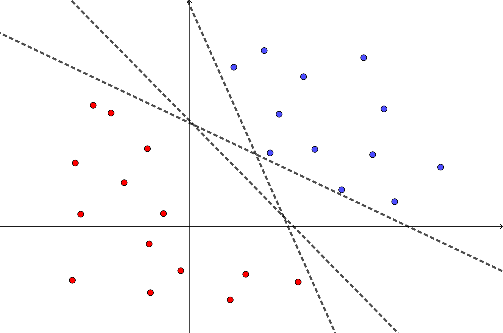
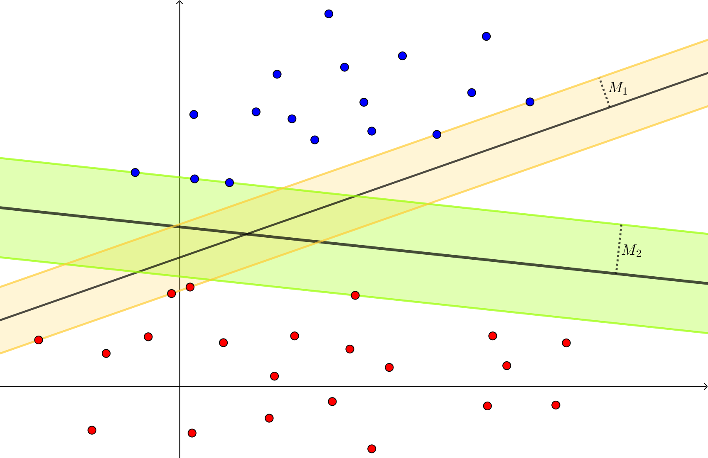
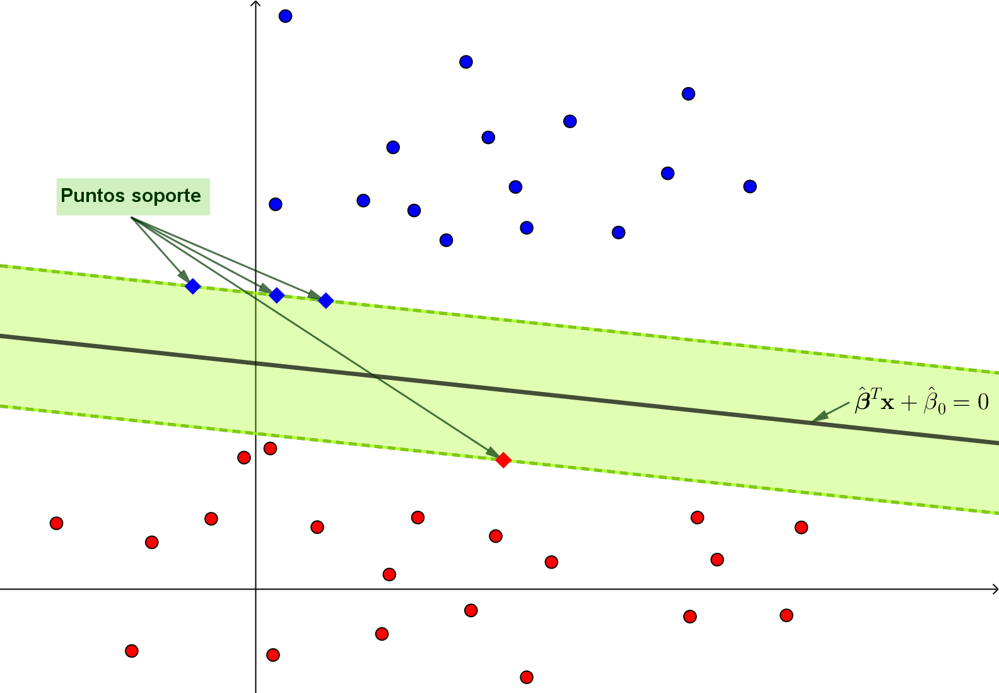
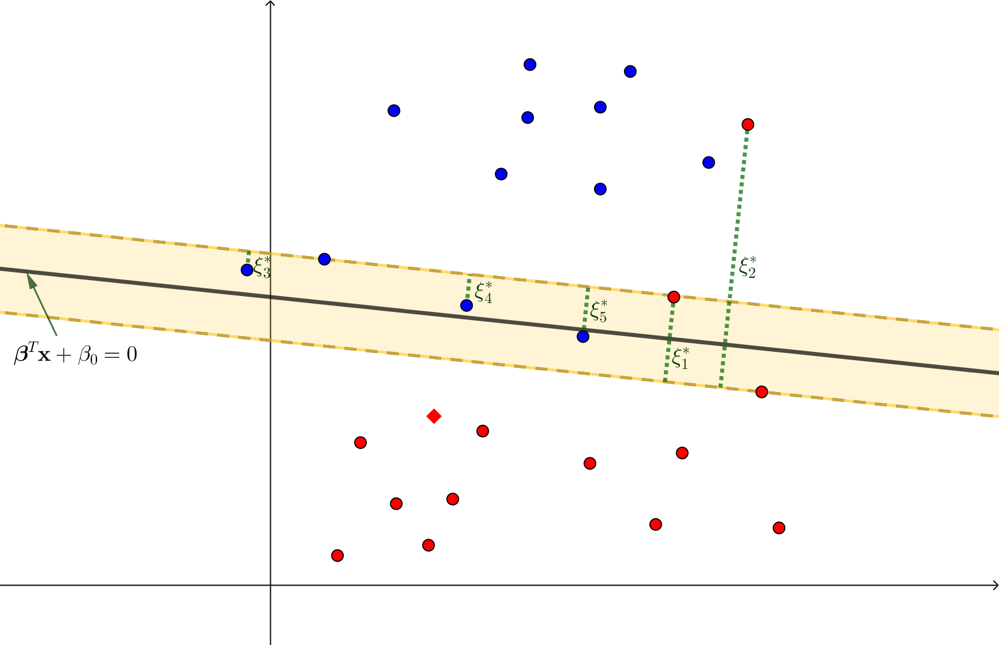
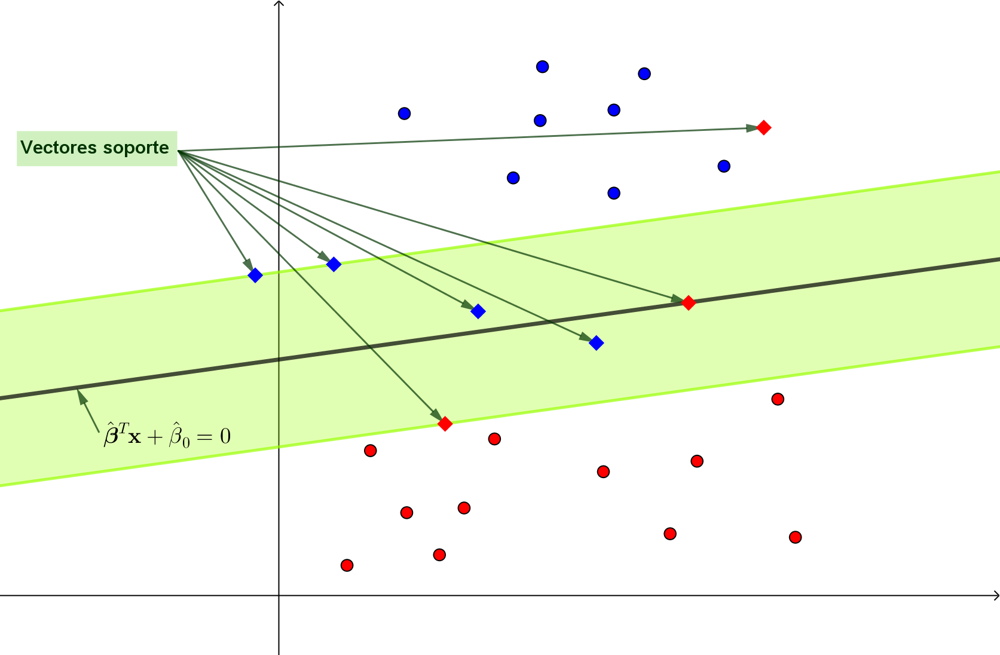



En esta sección vamos a estudiar un algoritmo de aprendizaje supervisado ampliamente utilizado para problemas de clasificación, que ha demostrado ser especialmente efectivo en tareas donde se requiere obtener fronteras de decisión robustas y con buena capacidad de generalización. Su construcción sigue una secuencia natural de conceptos: en primer lugar, se aborda la formulación básica basada en hiperplanos separadores óptimos, cuyo objetivo es maximizar el margen de separación entre clases perfectamente separables; luego, se incorpora el uso de *variables de holgura* para tratar datos no separables; y, finalmente, se presenta la generalización mediante *núcleos reproductores*, lo que permite obtener fronteras de decisión no lineales.

Una característica distintiva de estos métodos es que su desarrollo se apoya fuertemente en la formulación dual de problemas de optimización y en las condiciones de Karush-Kuhn-Tucker (KKT), lo que proporciona una interpretación clara en términos de vectores soporte y explica su gran potencial.

En lo que sigue, vamos a asumir que estamos trabajando con un conjunto de datos de entrenamiento $\{(\xx_i,y_i)\}_{i=1}^n$ de un problema de clasificación binaria cuya variable respuesta, por cuestiones de simplicidad, se considera $Y\in\{-1,+1\}$.

## Hiperplano separador óptimo

El caso más simple de análisis surge de suponer que las clases $\{\xx_i \mid y_i=-1\}$ y $\{\xx_i \mid y_i=+1\}$ pueden ser separados totalmente por una frontera lineal. 

::: {.definicion}
**Definición 1.** (Separabilidad lineal) Un conjunto de datos $\{(\xx_i,y_i)\}_{i=1}^n$, con $y_i\in\{-1,+1\}$, se dice que es *linealmente separable* si existen $\bfbeta\in\RR^p$ y $\beta_0\in\RR$ tales que
$$
y_i=\text{sign}(\bfbeta^\top\xx_i+\beta_0)\qquad \forall i=1,\ldots,n.
\tag{1}
$$

El hiperplano $\bfbeta^\top\xx+\beta_0=0$ se denomina *hiperplano separador* y la función $f:\RR^p\to\RR$ definida por $f(\xx)=\bfbeta^\top\xx+\beta_0$ se conoce como *función score*. 

:::

::: {.callout .question}

📝 
Pruebe que $\bfbeta$ es el vector normal al hiperplano $\bfbeta^\top\xx+\beta_0=0$.

:::

<figure style="text-align: center;">
  
  <figcaption> **Figura 1**. Datos totalmente separables y algunos hiperplanos separadores. </figcaption>
</figure>

Observar que la expresión (1) es equivalente a requerir
$$
y_i(\bfbeta^\top\xx_i+\beta_0)>0\qquad\forall i=1,\ldots, n.
\tag{2}
$$

Algo intuitivo (ver Figura 1) es que si las clases son totalmente separables, existen infinitos hiperplanos separadores. Por lo tanto, resulta necesario definir un criterio que permita seleccionar un hiperplano único y óptimo.

::: {.myhighlight2}
*Primer principio*

Cada vector $\bfbeta\in\RR^p$ puede definir un único hiperplano separador.

:::

Dado $\bfbeta\in\RR^p$, asociamos a él el hiperplano separador con vector normal $\bfbeta$ que *equidista* a ambas clases. Para poder caracterizar esto matemáticamente, necesitamos antes imponer una restricción de normalización, debido a que la distancia de un punto al hiperplano depende de $\|\bfbeta\|_2$.

::: {.callout .question}

📝 
Pruebe que la distancia entre un punto $\xx_0\in\RR^p$ y el hiperplano $\bfbeta^\top\xx+\beta_0=0$ es igual a $|f(\xx_0)|/\|\bfbeta\|_2$.

:::

::: {.myhighlight2}
*Segundo principio*

Se restringe la elección de $\bfbeta$ a aquellos vectores que cumplen $\|\bfbeta\|_2=1$.

:::

Bajo estas condiciones, la distancia entre cualquier punto $\xx_i$ y el hiperplano $\bfbeta^\top\xx+\beta_0=0$ está dada por
$$
|f(\xx_i)|=y_i(\bfbeta^\top\xx_i+\beta_0),
$$
lo cual significa que decir que un hiperplano $\bfbeta^\top\xx+\beta_0=0$ equidista a ambas clases es equivalente a afirmar que existe una *distancia mínima* $M\in\RR$ tal que
$$
y_i(\bfbeta^\top\xx_i+\beta_0)\geq M\qquad\forall i=1,\ldots,n,
\tag{3}
$$
con igualdad para al menos un punto de cada clase. Los puntos para los cuales se cumple la igualdad en la restricción son los que caracterizan al hiperplano y se conocen como sus <mark>puntos soporte</mark>.

<figure style="text-align: center;">
  
  <figcaption> **Figura 2**. Hiperplanos separadores y sus margenes asociados. </figcaption>
</figure>

Ya estamos en condiciones de determinar qué consideraremos como hiperplano separador óptimo.

::: {.definicion}
**Definición 2.** (Hiperplano separador óptimo) Sea $\{(\xx_i,y_i)\}_{i=1}^n$, con $y_i\in\{-1,+1\}$, un conjunto de datos linealmente separable. El *hiperplano separador óptimo* es aquel que maximiza el *margen* $M$, definido como la distancia mínima entre el hiperplano y cada clase.

:::

En base a lo descrito, la búsqueda del hiperplano separador óptimo queda determinada por el siguiente problema de optimización:

$$
\begin{array}{ll}
\text{maximizar } & M\\
\text{sujeto a }  & y_i(\bfbeta^\top\xx_i+\beta_0)\geq M,\qquad i=1,\ldots,n,\\
                  & \|\bfbeta\|_2=1.
\end{array}
\tag{4}
$$

Por supuesto, las variables de optimización son $\bfbeta\in\RR^p$ y $\beta_0\in\RR$. Si bien esta formulación refleja directamente la intención de maximizar el margen, vamos a ajustarla para obtener una formulación clásica más conveniente.

### Formulación clásica

La restricción $\|\bfbeta\|_2=1$ permite interpretar a $M$ como la distancia mínima de los puntos al hiperplano. Si se relaja dicha condición, dicha interpretación sigue siendo cierta si se escribe
$$
\frac{y_i(\bfbeta^\top\xx_i+\beta_0)}{\|\bfbeta\|_2}\geq M,\qquad i=1,\ldots,n.
$$

En consecuencia, el problema (4) se puede reescribir como
$$
\begin{array}{ll}
\text{maximizar } & M\\
\text{sujeto a }  & y_i(\bfbeta^\top\xx_i+\beta_0)\geq \|\bfbeta\|_2M,\qquad i=1,\ldots,n,
\end{array}
\tag{5}
$$
con una pequeña diferencia: dado un punto óptimo $\bfbeta^\star$, ahora habrán infinitos puntos óptimos $k\bfbeta^\star$, con $k\in\RR$. De todos ellos, nos interesa particularmente aquel que verifica
$$
\|\bfbeta^\star\|_2=\frac{1}{M^\star},
$$
donde $M^\star$ es el margen óptimo. Esta idea nos va a permitir reformular el problema de optimización: 

::: {.myhighlight}
Para cada valor $M$ de la función objetivo, elegimos como vector normal del hiperplano separador asociado a aquel $\bfbeta$ que verifica $\|\bfbeta\|_2=1/M$.
:::

Claramente, bajo estas condiciones, maximizar $M$ es equivalente a minimizar $\|\bfbeta\|_2$ y, convenientemente,  también equivalente a minimizar $\frac{1}{2}\|\bfbeta\|_2^2$. De esta manera, retomando (5), podemos redefinir el problema de optimización (4) como sigue:
$$
\begin{array}{ll}
\text{minimizar } & \frac{1}{2}\|\bfbeta\|_2^2\\
\text{sujeto a }  & y_i(\bfbeta^\top\xx_i+\beta_0)\geq 1,\qquad i=1,\ldots,n.
\end{array}
\tag{6}
$$

::: {.myhighlight}
El problema (6) es un problema de optimización convexa cuyo conjunto factible es un poliedro.
:::

El Corolario 5 del [C1-S4](A4_condiciones_optimalidad.html#el-caso-particular-de-restricciones-afines) nos asegura que las condiciones de Karush-Kuhn-Tucker (KKT) son suficientes y necesarias para la optimalidad. Más aún, gracias al Teorema 7 de dicha sección, podemos afirmar que se cumple la dualidad fuerte, asegurando que el valor óptimo del problema primal coincide con el del problema dual.

### Aplicación de condiciones KKT y dualidad

Las condiciones KKT son
$$
\begin{array}{cl}
y_i((\bfbeta^\star)^\top\xx_i+\beta_0^\star)-1\geq 0\qquad\forall i=1,\ldots,n\qquad&\text{(Factibilidad primal)}\\[3pt]
\lambda_i^\star\geq 0\qquad\forall i=1,\ldots,n\qquad &\text{(Factibilidad dual)}\\[3pt]
\lambda_i^\star\left[y_i((\bfbeta^\star)^\top\xx_i+\beta_0^\star)-1\right]=0\qquad\forall i=1,\ldots,n\qquad&\text{(Holgura complementaria)}\\[3pt]
\bfbeta^\star=\sum_{i=1}^n\lambda_i^\star y_i\xx_i,\quad 0=\sum_{i=1}^n\lambda_i^\star y_i\qquad&\text{(Estacionariedad)}
\end{array}
$$

Si bien las condiciones KKT permiten caracterizar completamente la solución óptima, no proporcionan un método directo y eficiente para calcular $\bflambda^\star$. Por ello, resulta conveniente formular el problema dual de Lagrange, cuya resolución es computacionalmente más sencilla, esto último debido a que resulta ser un problema de optimización cuadrática.

El Lagrangiano asociado al problema (6) es $\calL:\RR^p\times\RR^n$ definido por
$$
\calL(\bfbeta,\bflambda)=\frac{1}{2}\|\bfbeta\|_2^2-\sum_{i=1}^n\lambda_i\left[y_i(\bfbeta^\top\xx_i+\beta_0)-1\right].
$$

Como ya sabemos, la ecuación $\nabla\calL=\bfzero$ conduce a las condiciones de estacionariedad de las KKT. Por lo tanto, la función dual
$$
\calG(\bflambda):=\inf_{\bfbeta}\calL(\bfbeta,\bflambda)
$$
resulta de sustituir dichas condiciones en el Lagrangiano. Es decir,
$$
\begin{align}
\calG(\bflambda)&=\frac{1}{2}\left\|\sum_{i=1}^n\lambda_iy_i\xx_i\right\|_2^2-\sum_{i=1}^n\lambda_iy_i\left(\sum_{j=1}^n\lambda_jy_j\xx_j\right)^\top\xx_i-\beta_0\underbrace{\sum_{i=1}^n\lambda_iy_i}_{=0}+\sum_{i=1}^n\lambda_i\\
&=\frac{1}{2}\sum_{i=1}^n\sum_{j=1}^n\lambda_i\lambda_j y_iy_j \xx_i^\top\xx_i-\sum_{i=1}^n\sum_{j=1}^n\lambda_i\lambda_j y_i y_j\xx_j^\top\xx_i+\sum_{i=1}^n\lambda_i\\
&=\sum_{i=1}^n\lambda_i-\frac{1}{2}\sum_{i=1}^n\sum_{j=1}^n\lambda_i\lambda_j y_iy_j\xx_j^\top\xx_i.
\end{align}
$$

Por lo tanto, el problema dual es
$$
\begin{array}{ll}
\text{maximizar } & \sum_{i=1}^n\lambda_i-\frac{1}{2}\sum_{i=1}^n\sum_{j=1}^n\lambda_i\lambda_j y_iy_j\xx_j^\top\xx_i\\
\text{sujeto a }  & \bflambda\succeq\bfzero.
\end{array}
\tag{7}
$$

::: {.panel-tabset}

### Interpretación de KKT

Pongamos foco en la factibilidad primal y la holgura complementaria:

$$
\begin{array}{cl}
y_i((\bfbeta^\star)^\top\xx_i+\beta_0^\star)-1\geq 0\qquad\forall i=1,\ldots,n\qquad&\text{(Factibilidad primal)}\\[3pt]
\lambda_i^\star\left[y_i((\bfbeta^\star)^\top\xx_i+\beta_0^\star)-1\right]=0\qquad\forall i=1,\ldots,n\qquad&\text{(Holgura complementaria)}\\[3pt]
\end{array}
$$

Si $\lambda_i^\star>0$, entonces
$$
y_i((\bfbeta^\star)^\top\xx_i+\beta_0^\star)=1,
$$
lo cual significa que $\xx_i$ es un punto soporte (es decir, está sobre el *borde* del margen). O lo que es lo mismo:

::: {.myhighlight}

Si $\xx_i$ no es un punto soporte, entonces $\lambda_i^\star=0$.

:::

<figure style="text-align: center;">
  
  <figcaption> **Figura 3**. Puntos soporte de un hiperplano separador óptimo. </figcaption>
</figure>

Por lo tanto, de la condición de estacionariedad, podemos afirmar que el punto óptimo $\bfbeta^\star$ está totalmente determinado por los puntos soporte. Podemos escribir
$$
\bfbeta^\star=\sum_{\substack{i=1\\\lambda_i^\star\neq 0}}^n\lambda_i^\star y_i\xx_i.
$$

### Procedimiento

Hiperplano separador óptimo

Para obtener el hiperplano separador óptimo de un conjunto de datos linealmente separable:

1. Se resuelve el problema dual (6) para obtener $\bflambda^\star$.

2. Se obtiene el punto óptimo $\bfbeta^\star$ mediante la condición de estacionariedad
$$
\bfbeta^\star=\sum_{\substack{i=1\\\lambda_i^\star\neq 0}}^n\lambda_i^\star y_i\xx_i.
$$

3. Se calcula el intercepto $\beta_0^\star$, promediando sobre los puntos soporteel valor 
$$
\beta_0^\star=y_i-\bfbeta^\top\xx_i,
$$
que resulta de despejar $\beta_0^\star$ de la condición de holgura complementaria.

:::

Una vez obtenidos los puntos óptimos $\bfbeta^\star$ y $\beta_0^\star$, resultan:

<table style="margin-left:auto; margin-right:auto; border-collapse: collapse; text-align: center; background-color: #f7faf7;">
  <tr style="border-bottom: 1px solid #cccccc;">
    <td style="padding: 16px 8px;">Hiperplano separador óptimo</td>
    <td style="padding: 16px 8px;">$(\bfbeta^\star)^\top\xx+\beta_0^\star=0$</td>
  </tr>
  <tr style="border-bottom: 1px solid #cccccc;">
    <td style="padding: 16px 8px;">Función score</td>
    <td style="padding: 16px 8px;">$\hat{f}(\xx)=(\bfbeta^\star)^\top\xx+\beta_0^\star$</td>
  </tr>
  <tr>
    <td style="padding: 16px 8px;">Clasificador</td>
    <td style="padding: 16px 8px;">$\hat{G}(\xx)=\text{sign}(\hat{f}(\xx))$</td>
  </tr>
</table>

## Variables de holgura y margen suave

En la formulación del hiperplano separador óptimo, se asume que el conjunto de datos $\{(\xx_i,y_i)\}_{i=1}^n$ es linealmente separable. Sin embargo, en la práctica lo habitual es que exista solapamiento entre las clases. Para extender el análisis del apartado anterior, la estrategia consiste en introducir *variables de holgura*, simbolizadas con $\boldsymbol{\xi}\in\RR^n$, que permitan que algunos puntos violen el margen o incluso queden mal clasificados. Este enfoque, conocido como *margen suave* (*soft-margin*, en inglés), es lo que desarrollaremos a continuación.

<figure style="text-align: center;">
  
  <figcaption> **Figura 4**. Variables de holgura. </figcaption>
</figure>

Partimos de la formulación primal del problema (6). Para incorporar las variables de holgura 
$\bfxi$, esta se modifica de la siguiente manera:

$$
\begin{array}{ll}
\text{minimizar } & \frac{1}{2}\|\bfbeta\|_2^2\\
\text{sujeto a }  & y_i(\bfbeta^\top\xx_i+\beta_0)\geq 1-\xi_i,\qquad i=1,\ldots,n,\\
                  & \bfxi\succeq\bfzero,\;\sum_{i=1}^n\xi_i\leq\text{cte}.
\end{array}
\tag{8}
$$

Este nuevo problema de optimización tiene variables $\bfbeta\in\RR^p$, $\beta_0\in\RR$ y $\bfxi\in\RR^{n}$. La restricción $\sum_{i=1}^n=\xi_i\leq\text{cte}$ permite controlar el grado de tolerancia a puntos que están dentro o del lado incorrecto del margen. Este control es más natural pensarlo como una penalización en la función objetivo, tal como vimos en los métodos de regularización en el capítulo anterior. En consecuencia, es conveniente usar una forma alternativa de (8):

$$
\begin{array}{ll}
\text{minimizar } & \frac{1}{2}\|\bfbeta\|_2^2+C\sum_{i=1}^n\xi_i\\
\text{sujeto a }  & y_i(\bfbeta^\top\xx_i+\beta_0)\geq 1-\xi_i,\qquad i=1,\ldots,n,\\
                  & \bfxi\succeq\bfzero.
\end{array}
\tag{9}
$$

A $C>0$ se lo conoce como <mark>*hiperparámetro de costo*</mark>.  Cuanto mayor es su valor, mayor es la penalización que el modelo impone sobre las violaciones del margen, lo que conduce a un clasificador más estricto que busca minimizar los errores de clasificación a costa de un margen posiblemente más estrecho. 

::: {.myhighlight}
El problema (9) es un problema de optimización convexa cuyo conjunto factible es un poliedro.
:::

::: {.callout .question}

📝 
Justifique la afirmación anterior.

:::

Estamos en condiciones de aplicar nuevamente las condiciones de Karush-Kuhn-Tucker (KKT) y la dualidad para caracterizar la solución de este problema. De ahora en adelante, nos referiremos al método construido hasta aquí como <mark>Máquinas de Vectores Soporte (SVM) lineales </mark>.

### Aplicación de condiciones KKT y dualidad

Es importante remarcar que el problema de optimización (9) tiene $2n$ restricciones de desigualdad, pues se han agregado
$$
\xi_i\geq 0\qquad\forall i=1,\ldots,n.
$$

Distinguiremos los multiplicadores asociados a estas restricciones con la notación $\bfmu=(\mu_1,\ldots,\mu_n)$. Las condiciones KKT son
$$
\begin{array}{cl}
y_i((\bfbeta^\star)^\top\xx_i+\beta_0^\star)-(1-\xi_i^\star)\geq 0\qquad\forall i=1,\ldots,n\qquad&\text{(Factibilidad primal)}\\[3pt]
\lambda_i^\star\geq 0,\;\mu_i^\star\geq 0\qquad\forall i=1,\ldots,n\qquad &\text{(Factibilidad dual)}\\[3pt]
\lambda_i^\star\left[y_i((\bfbeta^\star)^\top\xx_i+\beta_0^\star)-(1-\xi_i^\star)\right]=0,\quad\mu_i^\star\xi_i^\star=0\qquad\forall i=1,\ldots,n\qquad&\text{(Holgura complementaria)}\\[3pt]
\bfbeta^\star=\sum_{i=1}^n\lambda_i^\star y_i\xx_i,\quad 0=\sum_{i=1}^n\lambda_i^\star y_i,\quad C=\lambda_i^\star+\mu_i^\star\;(\forall i)\qquad&\text{(Estacionariedad)}
\end{array}
$$

Como antes, es conveniente formular el problema dual de Lagrange, el cual es un problema de optimización cuadrática. El Lagrangiano asociado al problema (8) es $\calL:\RR^p\times\RR^n\times\RR^n$ definido por
$$
\calL(\bfbeta,\bflambda,\bfmu)=\frac{1}{2}\|\bfbeta\|_2^2+C\sum_{i=1}^n\xi_i-\sum_{i=1}^n\lambda_i\left[y_i(\bfbeta^\top\xx_i+\beta_0)-(1-\xi_i)\right]-\sum_{i=1}^n\mu_i\xi_i.
$$

Sustituimos las condiciones de estacionariedad para obtener la función dual:
$$
\begin{align}
\calG(\bflambda)&=\frac{1}{2}\left\|\sum_{i=1}^n\lambda_iy_i\xx_i\right\|_2^2+C\sum_{i=1}^n\xi_i-\sum_{i=1}^n\lambda_iy_i\left(\sum_{j=1}^n\lambda_jy_j\xx_j\right)^\top\xx_i-\beta_0\underbrace{\sum_{i=1}^n\lambda_iy_i}_{=0}+\sum_{i=1}^n\lambda_i-\sum_{i=1}^n\underbrace{(\lambda_i+\mu_i)}_{=C}\xi_i\\
&=\frac{1}{2}\sum_{i=1}^n\sum_{j=1}^n\lambda_i\lambda_j y_iy_j \xx_i^\top\xx_i-\sum_{i=1}^n\sum_{j=1}^n\lambda_i\lambda_j y_i y_j\xx_j^\top\xx_i+\sum_{i=1}^n\lambda_i\\
&=\sum_{i=1}^n\lambda_i-\frac{1}{2}\sum_{i=1}^n\sum_{j=1}^n\lambda_i\lambda_j y_iy_j\xx_j^\top\xx_i.
\end{align}
$$

Hemos obtenido la misma función dual que para el caso sin variables de holgura. Sin embargo, el problema dual no es el mismo, puesto que hay que considerar la restricción $\bfmu\succeq \bfzero$. Resulta:
$$
\begin{array}{ll}
\text{maximizar } & \sum_{i=1}^n\lambda_i-\frac{1}{2}\sum_{i=1}^n\sum_{j=1}^n\lambda_i\lambda_j y_iy_j\xx_j^\top\xx_i\\
\text{sujeto a }  & \bflambda\succeq\bfzero,\;\bfmu\succeq\bfzero.
\end{array}
$$

De la condición de estacionariedad $C=\lambda_i+\mu_i$, podemos combinar las restricciones de no negatividad escribiendo $0\leq \lambda_i\leq C$. Finalmente, el problema de optimización dual es
$$
\begin{array}{ll}
\text{maximizar } & \sum_{i=1}^n\lambda_i-\frac{1}{2}\sum_{i=1}^n\sum_{j=1}^n\lambda_i\lambda_j y_iy_j\xx_j^\top\xx_i\\
\text{sujeto a }  & 0\leq \lambda_i\leq C,\quad i=1,\ldots,n.
\end{array}
\tag{10}
$$

::: {.panel-tabset}

### Interpretación de KKT

Nuevamente pongamos foco en la factibilidad primal y la holgura complementaria:

$$
\begin{array}{cl}
y_i((\bfbeta^\star)^\top\xx_i+\beta_0^\star)-(1-\xi_i)\geq 0\qquad\forall i=1,\ldots,n\qquad&\text{(Factibilidad primal)}\\[3pt]
\lambda_i^\star\left[y_i((\bfbeta^\star)^\top\xx_i+\beta_0^\star)-(1-\xi_i)\right]=0\qquad\forall i=1,\ldots,n\qquad&\text{(Holgura complementaria)}\\[3pt]
\end{array}
$$

Si $\lambda_i^\star>0$, entonces
$$
y_i((\bfbeta^\star)^\top\xx_i+\beta_0^\star)=1-\xi_i^\star.
$$

Si, además, $\xi_i^\star=0$, podemos afirmar que $\xx_i$ es un punto soporte (es decir, está sobre el *borde* del margen). Si, por el contrario, $\xi_i>0$, entonces $\xx_i$ viola el margen.

::: {.callout .question}

📝 
Analice en qué caso un punto soporte queda mal clasificado.

:::

Dado que queremos identificar como puntos soporte únicamente aquellos datos que realmente influyen en la solución del problema, definimos formalmente:

::: {.definicion}
**Definición 1.** (Vector soporte) Un dato $\xx_i$ se denomina *vector soporte* si el multiplicador asociado $\lambda_i$ es estrictamente positivo. 

:::

::: {.myhighlight}

Todo vector soporte se encuentra en una de las siguientes posiciones respecto al margen: en el borde, dentro del margen o fuera del margen pero mal clasificado.

:::

<figure style="text-align: center;">
  
  <figcaption> **Figura 5**. Puntos soporte de un hiperplano óptimo con margen suave. </figcaption>
</figure>

Por otro lado, si $y_i((\bfbeta^\star)^\top\xx_i+\beta_0^\star)>1-\xi_i^\star$, la holgura complementaria indica que debe ocurrir $\lambda_i^\star=0$. ¡Atención! Esto no descarta que pueden existir puntos con holgura positiva que no sean vectores soporte. Por ese motivo, analicemos la siguiente pregunta:

::: {.myhighlight3}

¿Qué característica tienen los puntos con holgura positiva?

:::

Si $\xi_i^\star>0$, la condición de holgura complementaria $\mu_i^\star\xi_i^\star=0$ junto a la condición de estacionariedad $C=\lambda_i^\star+\mu_i^\star$, nos permiten deducir que se verifica 
$$
\lambda_i^\star=C.
$$

Dado que asumimos $C>0$, concluimos que:

::: {.myhighlight}

Todo punto con holgura positiva es un vector soporte.

:::

A continuación, resumamos las posibilidades para un punto $\xx_i$ con multiplicador $\lambda_i^\star$.

::: {.callout .question}
📝 

<table>
  <thead>
    <tr>
      <th>Multiplicador</th>
      <th>¿Es vector soporte?</th>
      <th>¿Tiene holgura positiva?</th>
      <th>Posición respecto al margen</th>
    </tr>
  </thead>
  <tbody>
    <tr>
      <td>$\lambda_i^\star=0$</td>
      <td><input type="checkbox" name="afin1" /></td>
      <td><input type="checkbox" name="cono1" /></td>
      <td>
      <select name="miSelect1">
      <option value="" disabled selected>Seleccioná una opción...</option>
      <option value="opcion1">En el borde, bien clasificado.</option>
      <option value="opcion2">En el borde o fuera, pero bien clasificado.</option>
      <option value="opcion3">Viola el margen, mal clasificado.</option>
      <option value="opcion4">Viola el margen, bien o mal clasificado.</option>
      <option value="opcion5">Fuera, bien clasificado</option>
      <option value="opcion6">Fuera, mal clasificado</option>
      </select>
      </td>
    </tr>
    <tr>
      <td>$0<\lambda_i^\star<C$</td>
      <td><input type="checkbox" name="afin2" /></td>
      <td><input type="checkbox" name="cono2" /></td>
      <td>
      <select name="miSelect2">
      <option value="" disabled selected>Seleccioná una opción...</option>
      <option value="opcion1">En el borde, bien clasificado.</option>
      <option value="opcion2">En el borde o fuera, pero bien clasificado.</option>
      <option value="opcion3">Viola el margen, mal clasificado.</option>
      <option value="opcion4">Viola el margen, bien o mal clasificado.</option>
      <option value="opcion5">Fuera, bien clasificado</option>
      <option value="opcion6">Fuera, mal clasificado</option>
      </select>
      </td>
    </tr>
    <tr>
      <td>$\lambda_i^\star=C$</td>
      <td><input type="checkbox" name="afin2" /></td>
      <td><input type="checkbox" name="cono2" /></td>
      <td>
      <select name="miSelect3">
      <option value="" disabled selected>Seleccioná una opción...</option>
      <option value="opcion1">En el borde, bien clasificado.</option>
      <option value="opcion2">En el borde o fuera, pero bien clasificado.</option>
      <option value="opcion3">Viola el margen, mal clasificado.</option>
      <option value="opcion4">Viola el margen, bien o mal clasificado.</option>
      <option value="opcion5">Fuera, bien clasificado</option>
      <option value="opcion6">Fuera, mal clasificado</option>
      </select>
      </td>
    </tr>
  </tbody>
</table>

:::

### Procedimiento

SVM lineal

Para obtener el hiperplano óptimo de un conjunto de datos:

1. Se resuelve el problema dual (10) para obtener $\bflambda^\star$.

2. Se obtiene el punto óptimo $\bfbeta^\star$ mediante la condición de estacionariedad
$$
\bfbeta^\star=\sum_{\substack{i=1\\\lambda_i^\star\neq 0}}^n\lambda_i^\star y_i\xx_i.
$$

3. Se calcula el intercepto $\beta_0^\star$, promediando sobre los vectores soporte con holgura nula el valor 
$$
\beta_0^\star=y_i-\bfbeta^\top\xx_i,
$$
que resulta de despejar $\beta_0^\star$ de la condición de holgura complementaria.

:::

Tal como antes, una vez obtenidos los puntos óptimos $\bfbeta^\star$ y $\beta_0^\star$, resultan:

<table style="margin-left:auto; margin-right:auto; border-collapse: collapse; text-align: center; background-color: #f7faf7;">
  <tr style="border-bottom: 1px solid #cccccc;">
    <td style="padding: 16px 8px;">Hiperplano de decisión</td>
    <td style="padding: 16px 8px;">$(\bfbeta^\star)^\top\xx+\beta_0^\star=0$</td>
  </tr>
  <tr style="border-bottom: 1px solid #cccccc;">
    <td style="padding: 16px 8px;">Función score</td>
    <td style="padding: 16px 8px;">$\hat{f}(\xx)=(\bfbeta^\star)^\top\xx+\beta_0^\star$</td>
  </tr>
  <tr>
    <td style="padding: 16px 8px;">Clasificador</td>
    <td style="padding: 16px 8px;">$\hat{G}(\xx)=\text{sign}(\hat{f}(\xx))$</td>
  </tr>
</table>

## Núcleos reproductores

## Máquinas de vectores soporte no lineal

## Ejemplos de aplicación

  

## Actividades {.unnumbered}

✏️ **Conceptuales**  

1. ...

💻 **Prácticas**  

1. ...

::: {.refs}
<strong>Referencias</strong>

Hastie, T., Tibshirani, R., & Friedman, J. (2009). *The Elements of Statistical Learning: Data Mining, Inference, and Prediction* (2nd ed.). Capítulo 4, Sección 5 y Capítulo 12. Springer.

:::